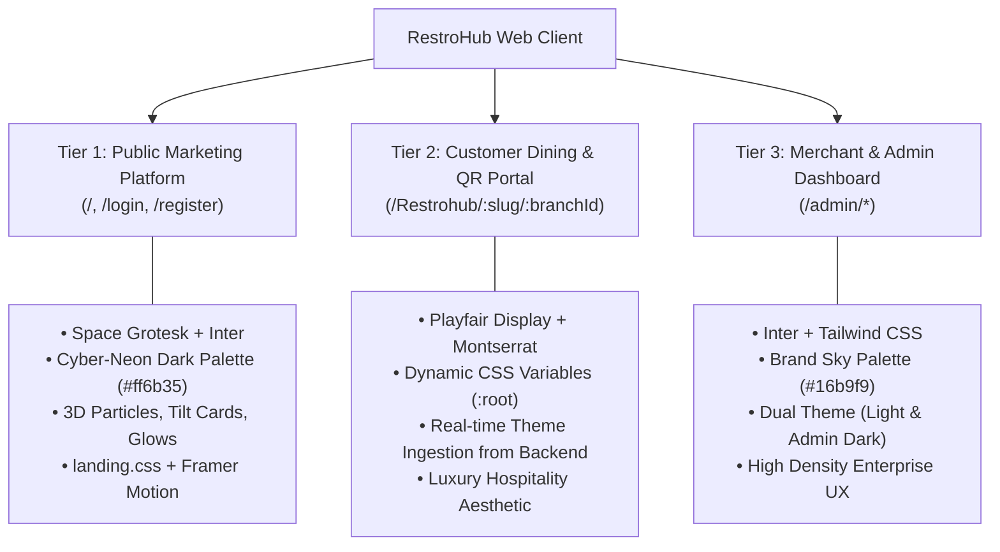

# RestroHub Frontend Design System & UI Guide

> **Project**: RestroHub (Restroly) Client Web Application  
> **Source Directory**: `D:\projects\gssoc_develop_restrohub\RestroHub-FrontEnd`  
> **Framework & Tooling**: React 18, Vite, Tailwind CSS 3, Framer Motion, Three.js / React Three Fiber, Lucide Icons, Headless UI, Formik & Yup  
> **File Version**: 1.0.0  

---

## Table of Contents

1. [Design Architecture Overview](#1-design-architecture-overview)
2. [Typography & Fonts](#2-typography--fonts)
   - [Typefaces Catalog](#typefaces-catalog)
   - [Font Scale & Sizing Tokens](#font-scale--sizing-tokens)
   - [Typographic Hierarchy & Heading Rules](#typographic-hierarchy--heading-rules)
3. [Color Systems & Theming Architecture](#3-color-systems--theming-architecture)
   - [The Three Design Tiers](#the-three-design-tiers)
   - [Tier 1: Marketing / Landing System (Futuristic Neon Dark)](#tier-1-marketing--landing-system)
   - [Tier 2: Customer Microsite Dynamic CSS Variable System](#tier-2-customer-microsite-dynamic-css-variable-system)
   - [Pre-Configured Customer Theme Palettes](#pre-configured-customer-theme-palettes)
   - [Tier 3: Admin & Merchant Dashboard System (Tailwind + Forms)](#tier-3-admin--merchant-dashboard-system)
   - [Dark Mode & Theme Switching Engine](#dark-mode--theme-switching-engine)
4. [Spacing, Grid & Elevation Tokens](#4-spacing-grid--elevation-tokens)
   - [Spacing Scale](#spacing-scale)
   - [Border Radius Hierarchy](#border-radius-hierarchy)
   - [Box Shadows & Glow Effects](#box-shadows--glow-effects)
   - [Z-Index Layering Scale](#z-index-layering-scale)
5. [Component Design Standards & Patterns](#5-component-design-standards--patterns)
   - [Buttons & Interactive CTAs](#buttons--interactive-ctas)
   - [Form Inputs & Controls](#form-inputs--controls)
   - [Cards & Glassmorphism Surfaces](#cards--glassmorphism-surfaces)
   - [Navigation & Headers](#navigation--headers)
   - [Customer Microsite Modular Sections](#customer-microsite-modular-sections)
   - [Floating Action Buttons & Drawers](#floating-action-buttons--drawers)
   - [Badges, Dietary Flags & Order Statuses](#badges-dietary-flags--order-statuses)
   - [Feedback, Spinners & Skeletons](#feedback-spinners--skeletons)
6. [Animations & Motion Design](#6-animations--motion-design)
7. [Responsive Breakpoints & Layout Constraints](#7-responsive-breakpoints--layout-constraints)

---

## 1. Design Architecture Overview

RestroHub utilizes a **Tri-Tier UI Architecture** designed to meet three fundamentally different user contexts while maintaining visual excellence and brand integrity:



- **Customer QR Microsite**: Driven completely by **CSS custom properties (`--var`)** mapped dynamically via `SiteContext.jsx` and the backend `Theme` entity. Any restaurant brand can inject its custom colors, typography, and layout options seamlessly at runtime.
- **Admin Dashboard**: Built with **Tailwind CSS 3** utility classes, custom `brand` color ramps, and automatic class toggling (`.dark`, `.admin-dark`) with strict form element normalization.
- **Public Landing & Auth**: Styled with bespoke modern CSS (`landing.css`), 3D WebGL scenes (`@react-three/fiber`), and fluid Lenis scrolling.

---

## 2. Typography & Fonts

### Typefaces Catalog

The application loads four specialized Google Font families via `index.html` and `landing.css`:

```html
<link rel="preconnect" href="https://fonts.googleapis.com">
<link rel="preconnect" href="https://fonts.gstatic.com" crossorigin>
<link href="https://fonts.googleapis.com/css2?family=Playfair+Display:wght@400;500;600;700&family=Montserrat:wght@300;400;500;600&display=swap" rel="stylesheet">
```

```css
@import url("https://fonts.googleapis.com/css2?family=Inter:wght@300;400;500;600;700;800;900&family=Space+Grotesk:wght@400;500;600;700&display=swap");
```

| Font Family | Weights In Use | Classification | Primary Use Cases | Emotional Tone |
|---|---|---|---|---|
| **Playfair Display** | `400, 500, 600, 700` | High-contrast Serif | Customer Microsite Headings, Hero titles, Section headers (`.font-heading`) | Luxurious, elegant, culinary, premium |
| **Montserrat** | `300, 400, 500, 600` | Geometric Sans-Serif | Customer Microsite Body copy, navigation links, menu item descriptions | Clean, warm, highly legible, modern |
| **Space Grotesk** | `400, 500, 600, 700` | Monospace-inspired Sans | Landing Page Hero titles, metric highlights, key marketing callouts | Futuristic, technical, innovative, cutting-edge |
| **Inter** | `300, 400, 500, 600, 700, 800, 900` | Humanist Neo-Grotesque | Admin Dashboard (all text), Landing page body, form labels, data grids | Highly neutral, crystal clear, optimized for screens |

---

### Font Scale & Sizing Tokens

Defined globally in `src/styles/variables.css`:

| CSS Variable | Rem Value | Pixel Equivalent | Line Height | Usage Context |
|---|---|---|---|---|
| `--text-xs` | `0.75rem` | `12px` | `1.4` | Badges, timestamps, fine print, table tooltips |
| `--text-sm` | `0.875rem` | `14px` | `1.5` | Form labels, helper text, section subtitles, buttons |
| `--text-base` | `1.00rem` | `16px` | `1.6` | Standard body text, inputs, menu descriptions |
| `--text-lg` | `1.125rem` | `18px` | `1.6` | Large body, menu item pricing, card subtitles |
| `--text-xl` | `1.25rem` | `20px` | `1.4` | Small titles, modal headers, card titles |
| `--text-2xl` | `1.50rem` | `24px` | `1.3` | Section headings, KPI metric cards |
| `--text-3xl` | `1.875rem` | `30px` | `1.25` | Subsection primary titles, drawer headings |
| `--text-4xl` | `2.25rem` | `36px` | `1.2` | Mobile section titles, landing sub-heroes |
| `--text-5xl` | `3.00rem` | `48px` | `1.15` | Tablet section titles, landing feature titles |
| `--text-6xl` | `3.75rem` | `60px` | `1.1` | Desktop section titles (`.section-title`) |
| `--text-7xl` | `4.50rem` | `72px` | `1.05` | Landing page hero statements |
| `--text-8xl` | `6.00rem` | `96px` | `1.0` | Large display numbers and decorative metrics |
| `--text-9xl` | `8.00rem` | `128px` | `0.95` | Watermark backgrounds, oversized typography |

---

### Typographic Hierarchy & Heading Rules

```
H1 (Hero Main)         --> font-family: Playfair Display / Space Grotesk | font-size: 3.75rem - 4.5rem | weight: 700
H2 (Section Titles)    --> font-family: Playfair Display                 | font-size: 2.25rem - 3.75rem | weight: 700
Subtitle / Eyebrow     --> font-family: Montserrat / Inter               | font-size: 0.875rem          | weight: 600 | letter-spacing: 0.3em | text-transform: uppercase
H3 (Card / Modal Head) --> font-family: Montserrat / Inter               | font-size: 1.25rem - 1.5rem  | weight: 600
Body Copy              --> font-family: Montserrat / Inter               | font-size: 1.00rem           | weight: 400 | line-height: 1.6
Button Label           --> font-family: Montserrat / Inter               | font-size: 0.875rem          | weight: 600 | letter-spacing: 0.1em | text-transform: uppercase
```

- **Section Subtitle Styling**:
  ```css
  .section-subtitle {
      color: var(--color-primary);
      letter-spacing: 0.3em;
      text-transform: uppercase;
      font-size: var(--text-sm);
      margin-bottom: var(--spacing-md);
  }
  ```
- **Text Stroke Effect**:
  ```css
  .text-stroke {
      -webkit-text-stroke: 1px var(--color-text-primary);
      color: transparent;
  }
  ```

---

## 3. Color Systems & Theming Architecture

### The Three Design Tiers

```
┌────────────────────────────────────────────────────────────────────────┐
│  Tier 1: Landing & Auth      → Coral Glow (#ff6b35) on Jet Black       │
│  Tier 2: Customer Microsite  → Dynamic Tokens via CSS Variables (:root) │
│  Tier 3: Merchant Dashboard  → Cyan Brand (#16b9f9) + Neutral Grayscale │
└────────────────────────────────────────────────────────────────────────┘
```

---

### Tier 1: Marketing / Landing System

Designed for high-impact visual appeal to prospective restaurant owners.

| Token | Hex / Value | Role & Usage |
|---|---|---|
| `--primary` | `#ff6b35` | Vibrant Coral - Primary CTA button, active icons, glowing highlights |
| `--primary-light` | `#ff8f66` | Hover state for primary CTAs |
| `--primary-dark` | `#e55a2b` | Pressed / Active state for buttons |
| `--bg-dark` | `#0a0a0f` | Deep obsidian backdrop of the entire page |
| `--bg-card` | `#12121a` | Dark elevated card container background |
| `--bg-card-hover` | `#1a1a25` | Card hover state with subtle lift |
| `--border` | `rgba(255, 255, 255, 0.06)` | Ultra-thin glass border for content separators |
| `--border-hover` | `rgba(255, 255, 255, 0.12)` | Border highlight on user hover |
| `--text-primary` | `#ffffff` | Pure white headings and high-contrast text |
| `--text-secondary` | `rgba(255, 255, 255, 0.6)` | Soft gray for descriptions and body paragraphs |
| `--text-tertiary` | `rgba(255, 255, 255, 0.4)` | Sub-captions, footer copyright, disclaimers |
| `--gradient-primary` | `linear-gradient(135deg, #ff6b35, #ff3d7f)` | Gradient used on prominent CTA buttons and badges |
| `--shadow-glow` | `0 0 80px rgba(255, 107, 53, 0.15)` | Diffuse ambient neon glow behind cards |

---

### Tier 2: Customer Microsite Dynamic CSS Variable System

The customer-facing digital menu and restaurant microsite uses a **fully decoupled CSS variable architecture**. When a diner loads `/Restrohub/:restaurantSlug/:branchId`, `SiteContext.jsx` downloads the active `Theme` and assigns these variables to `:root`:

```css
:root {
    /* Primary Colors */
    --color-primary: #f59e0b;
    --color-primary-hover: #fbbf24;
    --color-primary-dark: #d97706;
    
    /* Background Colors */
    --color-bg-primary: #000000;
    --color-bg-secondary: #0a0a0a;
    --color-bg-tertiary: #171717;
    --color-bg-card: #1a1a1a;
    
    /* Text Colors */
    --color-text-primary: #ffffff;
    --color-text-secondary: #9ca3af;
    --color-text-muted: #6b7280;
    --color-text-accent: var(--color-primary);
    
    /* Border Colors */
    --color-border-primary: #374151;
    --color-border-secondary: #1f2937;
    --color-border-accent: var(--color-primary);
    
    /* Component Colors */
    --color-header-bg: #0a0a0a;
    --color-footer-bg: #0a0a0a;
    --color-button-bg: var(--color-primary);
    --color-button-text: #ffffff;
    
    /* Overlays */
    --color-overlay-dark: rgba(0, 0, 0, 0.5);
    --color-overlay-darker: rgba(0, 0, 0, 0.6);
    --color-overlay-light: rgba(0, 0, 0, 0.2);
}
```

---

### Pre-Configured Customer Theme Palettes

RestroHub comes with five ready-to-use color schemes curated for different dining genres:

```
1. Default Amber Gold (Fine Dining & Lounge)
   Primary: #f59e0b | Hover: #fbbf24 | Background: #000000 | Card: #1a1a1a

2. Elegant Gold (Luxury European / Steakhouse)
   Primary: #d4af37 | Hover: #e6c558 | Background: #0d0d0d | Card: #1a1a1a

3. Modern Teal (Seafood / Contemporary Bistro)
   Primary: #14b8a6 | Hover: #2dd4bf | Background: #0f172a | Card: #1e293b

4. Warm Rose (Cocktail Bar / Patisserie / Cafe)
   Primary: #f43f5e | Hover: #fb7185 | Background: #18181b | Card: #27272a

5. Classic Burgundy (Wine Bar / Italian Trattoria)
   Primary: #9f1239 | Hover: #be123c | Background: #1c1917 | Card: #292524

6. Vibrant Blue Fallback
   Primary: #3b82f6 | Hover: #60a5fa | Background: #0a0a0a | Card: #1a1a1a
```

---

### Tier 3: Admin & Merchant Dashboard System

Configured in `tailwind.config.js` for data clarity and operational speed:

```javascript
// tailwind.config.js
theme: {
  extend: {
    colors: {
      brand: {
        50: '#fff7ed',   // Subtle highlight background
        100: '#d5f0ff',  // Light badge & tag background
        500: '#16b9f9',  // Primary dashboard action & icon color
        600: '#0ca4ea',  // Hover state for primary buttons
        700: '#0c88c2',  // Active / pressed sidebar links
      }
    }
  }
}
```

#### Admin Grayscale Tones
- **Light Mode**:
  - Main app background: `bg-gray-50` (`#f9fafb`)
  - Content containers & cards: `bg-white` (`#ffffff`)
  - Borders: `border-gray-200` (`#e5e7eb`)
  - Primary text: `text-gray-900` (`#111827`)
  - Subtext: `text-gray-500` (`#6b7280`)
- **Dark Mode (`.admin-dark` / `.dark`)**:
  - Main app background: `bg-gray-900` (`#111827`)
  - Content containers & cards: `bg-gray-800` (`rgb(31, 41, 55)`)
  - Form input surfaces: `bg-gray-900` (`rgb(17, 24, 39)`)
  - Borders: `border-gray-700` (`rgb(75, 85, 99)`)
  - Primary text: `text-gray-100` (`rgb(243, 244, 246)`)
  - Subtext: `text-gray-400` (`rgb(156, 163, 175)`)

---

### Dark Mode & Theme Switching Engine

Dark mode is controlled at two levels:

1. **Admin / Platform Level**:
   ```javascript
   // tailwind.config.js
   darkMode: ['selector', ['.dark', '.admin-dark']]
   ```
   - Managed via `ThemeContext.jsx` and `AdminThemeContext.jsx`.
   - Reads preference from `localStorage.getItem('theme')` or system `prefers-color-scheme`.
   - Toggles classes `.dark` and `.admin-dark` on `document.documentElement`.
   - `global.css` automatically forces high-contrast dark backgrounds and light text on all admin components:
     ```css
     .dark .admin-content .bg-white,
     .dark .admin-content .bg-gray-50 {
         background-color: rgb(31 41 55) !important;
     }
     .dark .admin-content input, textarea, select {
         background-color: rgb(17 24 39) !important;
         border-color: rgb(75 85 99) !important;
         color: rgb(243 244 246) !important;
     }
     ```

2. **Customer Microsite Level**:
   - Evaluates `theme.isDarkMode` received from the database.
   - Sets attribute `data-site-theme="dark"` or `data-site-theme="light"` on `<html>`.
   - Adapts sticky navigation and loader transparency accordingly.

---

## 4. Spacing, Grid & Elevation Tokens

### Spacing Scale

Defined in `src/styles/variables.css`:

| Token | Rem Value | Pixel Value | Typical Application |
|---|---|---|---|
| `--spacing-xs` | `0.25rem` | `4px` | Badge padding, icon margins |
| `--spacing-sm` | `0.50rem` | `8px` | Gap between text and inline icons |
| `--spacing-md` | `1.00rem` | `16px` | Standard button padding (Y), card inner gutter |
| `--spacing-lg` | `1.50rem` | `24px` | Standard input padding (X), drawer spacing |
| `--spacing-xl` | `2.00rem` | `32px` | Button padding (X), card outer margin |
| `--spacing-2xl`| `3.00rem` | `48px` | Section header bottom spacing |
| `--spacing-3xl`| `4.00rem` | `64px` | Between content blocks on mobile |
| `--spacing-4xl`| `6.00rem` | `96px` | Standard section top/bottom padding (`.section`) |

---

### Border Radius Hierarchy

| Token | Radius Value | Component Targets |
|---|---|---|
| `--radius-sm` | `0.25rem` (`4px`) / `8px` | Tags, checkboxes, small utility badges |
| `--radius-md` | `0.50rem` (`8px`) / `12px` | Form text fields, action buttons, table rows |
| `--radius-lg` | `1.00rem` (`16px`) / `20px` | Dish cards, modal dialogs, drawer panels |
| `--radius-xl` | `1.75rem` (`28px`) | Standout marketing feature cards |
| `--radius-full`| `9999px` | Circular avatar images, pill badges, scrollbar thumb, FAB button |

---

### Box Shadows & Glow Effects

```css
/* Standard Elevation */
--shadow-sm: 0 1px 3px rgba(0, 0, 0, 0.3);
--shadow-md: 0 4px 8px rgba(0, 0, 0, 0.35);
--shadow-lg: 0 10px 20px rgba(0, 0, 0, 0.4);

/* Ambient Marketing Glow */
--shadow-glow: 0 0 80px rgba(255, 107, 53, 0.15);
```

---

### Z-Index Layering Scale

Standardized scale to avoid layering conflicts across modals, popovers, and sticky bars:

| Token | Value | Component Usage |
|---|---|---|
| `--z-dropdown` | `100` | Select dropdown menus, user profile flyout |
| `--z-sticky` | `200` | Sticky navigation bar (`.nav-scrolled`), table sticky headers |
| `--z-fixed` | `300` | Floating Action Button (`ServiceFAB`), Table banner |
| `--z-modal` | `400` | Customer order drawer, checkout modal, confirmation dialogs |
| `--z-tooltip` | `500` | Toast notifications (`react-hot-toast`), tooltips |

---

## 5. Component Design Standards & Patterns

### Buttons & Interactive CTAs

Defined in `src/styles/global.css`:

```css
.btn {
    display: inline-block;
    padding: var(--spacing-md) var(--spacing-xl);
    font-size: var(--text-sm);
    font-weight: 600;
    text-transform: uppercase;
    letter-spacing: 0.1em;
    text-decoration: none;
    transition: all var(--transition-normal);
    cursor: pointer;
    border: none;
    outline: none;
}
```

```
┌───────────────────────────────────────────────┐
│ .btn-primary                                  │  Solid accent background
│ background: var(--color-primary);             │  color: #000000;
│ hover: var(--color-primary-hover);            │
├───────────────────────────────────────────────┤
│ .btn-outline                                  │  Ghost button with white border
│ border: 2px solid #ffffff;                    │  hover: fill white, black text
├───────────────────────────────────────────────┤
│ .btn-outline-accent                           │  Ghost button with accent border
│ border: 2px solid var(--color-primary);       │  hover: fill accent, black text
└───────────────────────────────────────────────┘
```

---

### Form Inputs & Controls

Consistent styling for inputs across authentication and reservation forms:

```css
.input {
    width: 100%;
    background: transparent;
    border: 1px solid var(--color-border-primary);
    padding: var(--spacing-md) var(--spacing-lg);
    color: var(--color-text-primary);
    font-family: var(--font-primary);
    font-size: var(--text-base);
    transition: border-color var(--transition-normal);
    outline: none;
}

.input:focus {
    border-color: var(--color-primary);
}

.input::placeholder {
    color: var(--color-text-muted);
}
```

- **Dropdown Selects**: Native arrows replaced with custom SVG chevron icons via CSS background image:
  ```css
  select.input {
      appearance: none;
      background-image: url("data:image/svg+xml,...");
      background-repeat: no-repeat;
      background-position: right 1rem center;
      background-size: 1rem;
      padding-right: 2.5rem;
  }
  ```
- **Password Input Edge Fix**: Disables native Microsoft Edge reveal eye icon to ensure parity with custom reveal buttons:
  ```css
  input[type="password"]::-ms-reveal,
  input[type="password"]::-ms-clear {
      display: none !important;
  }
  ```

---

### Cards & Glassmorphism Surfaces

Used across customer menus and marketing highlights:

```css
.card {
    background-color: var(--color-bg-card);
    border: 1px solid var(--color-border-secondary);
    border-radius: var(--radius-lg);
    padding: var(--spacing-xl);
    transition: transform var(--transition-normal), border-color var(--transition-normal);
}

.card:hover {
    border-color: var(--color-border-accent);
    transform: translateY(-4px);
}
```

---

### Navigation & Headers

Sticky headers transition from transparent to frosted glass on scroll:

```css
.nav-scrolled {
    background: rgba(0, 0, 0, 0.95) !important;
    backdrop-filter: blur(10px);
    padding-top: 1rem !important;
    padding-bottom: 1rem !important;
}

[data-site-theme="light"] .nav-scrolled {
    background: rgba(255, 255, 255, 0.95) !important;
    backdrop-filter: blur(10px);
    box-shadow: 0 1px 10px rgba(0, 0, 0, 0.08);
}
```

---

### Customer Microsite Modular Sections

The dining microsite renders 8 modular sections defined in `src/components/customer/`:

1. **Navigation (`Navigation.jsx`)**: Brand logo, tagline, established badge, dynamic nav links, cart drawer trigger with item badge.
2. **Hero (`HeroSection.jsx`)**: Full-height background image (`.hero-bg`), multi-line title, primary CTA (`#menu`), secondary CTA (`#reservations`).
3. **About (`AboutSection.jsx`)**: Story overview, cuisine description, image collage, key stats (`25+ Chefs`, `10K+ Customers`), hours of operation.
4. **Menu (`MenuSection.jsx`)**: Category tabs, search & filter bars, food item cards with dietary tags, spice levels, add-to-cart buttons.
5. **Reservations (`ReservationsSection.jsx`)**: Guest count selector, date picker, time slot chips, contact inputs.
6. **Gallery (`GallerySection.jsx`)**: Visual grid of restaurant ambiance, interior, and signature creations with lightbox hover zoom.
7. **Contact (`ContactSection.jsx`)**: Branch phone numbers, physical address with Google Maps integration, email support.
8. **Footer (`Footer.jsx`)**: Brand bio, quick navigation links, opening hours, social media links, copyright.

---

### Floating Action Buttons & Drawers

- **Service FAB (`ServiceFAB.jsx`)**:
  - Located at bottom-right of the screen (`z-index: 300`).
  - Allows diners to trigger immediate service notifications: **"Call Waiter"** or **"Request Bill"**.
  - Animated pulsing glow to ensure discoverability.
- **Order Drawer (`CustomerOrderDrawer.jsx`)**:
  - Slide-in panel from the right (`z-index: 400`).
  - Displays selected items, quantity increments/decrements, special notes per dish, tax/total calculations, and checkout trigger.

---

### Badges, Dietary Flags & Order Statuses

#### Dietary Indicators
- **Vegetarian Badge**: Green border square with green inner dot (`#22c55e`).
- **Non-Vegetarian Badge**: Red border square with red inner triangle/dot (`#ef4444`).

#### Order Lifecycle Status Badges
| Status | Badge Background | Badge Text | Meaning |
|---|---|---|---|
| `PENDING` | `bg-amber-100 text-amber-800` | Amber | Order placed, awaiting restaurant acknowledgment |
| `CONFIRMED` | `bg-blue-100 text-blue-800` | Blue | Kitchen accepted the order |
| `PREPARING` | `bg-indigo-100 text-indigo-800` | Indigo | Chefs are cooking the items |
| `READY` | `bg-purple-100 text-purple-800` | Purple | Dishes ready for table delivery |
| `SERVED` | `bg-emerald-100 text-emerald-800` | Emerald | Delivered to dining table |
| `COMPLETED` | `bg-green-100 text-green-800` | Green | Order satisfied |
| `BILLED` | `bg-teal-100 text-teal-800` | Teal | Bill generated / transacted |
| `CANCELLED` | `bg-rose-100 text-rose-800` | Rose | Order voided or rejected |

---

### Feedback, Spinners & Skeletons

- **Circular Loader (`.loader`)**:
  ```css
  .loader {
      border: 3px solid rgba(255, 255, 255, 0.1);
      border-top-color: var(--color-primary);
      border-radius: 50%;
      width: 40px;
      height: 40px;
      animation: spin 1s linear infinite;
  }
  ```
- **Skeleton Shimmer**: Used in `AdminSkeleton.jsx` using Tailwind's `animate-pulse` and `bg-gray-200 dark:bg-gray-700` to prevent layout shift during queries.

---

## 6. Animations & Motion Design

Micro-interactions are handled via both CSS keyframes and Framer Motion:

### CSS Keyframes (`global.css`)
```css
/* Spin */
@keyframes spin {
    to { transform: rotate(360deg); }
}

/* Fade In */
@keyframes fadeIn {
    from { opacity: 0; transform: translateY(20px); }
    to { opacity: 1; transform: translateY(0); }
}

/* Fade In Up */
@keyframes fadeInUp {
    from { opacity: 0; transform: translateY(30px); }
    to { opacity: 1; transform: translateY(0); }
}

/* Pulse */
@keyframes pulse {
    0%, 100% { opacity: 1; }
    50% { opacity: 0.5; }
}
```

### Transition Timings
- `--transition-fast`: `150ms ease` (Buttons, hover states, toggles)
- `--transition-normal`: `300ms ease` (Card expansions, dropdown reveals)
- `--transition-slow`: `500ms ease` (Theme transitions, page layout shifts)

### Smooth Scrolling (Lenis)
The application leverages the `lenis` smooth scrolling library on public pages to ensure friction-free inertial scrolling on desktop and mobile browsers.

---

## 7. Responsive Breakpoints & Layout Constraints

RestroHub conforms to standard Tailwind responsive breakpoints:

| Breakpoint Prefix | Min Width | Target Devices | Layout Behavior |
|---|---|---|---|
| `sm:` | `640px` | Large phones, small tablets | 2-column food item grids, compacted drawers |
| `md:` | `768px` | Tablets, iPads | Hero parallax enabled, 2-to-3 column layouts |
| `lg:` | `1024px` | Laptops, desktop monitors | Desktop navigation bar, side-by-side about section |
| `xl:` | `1280px` | Large desktop displays | Standard container max width (`1280px`) |
| `2xl:` | `1536px` | Ultra-wide displays | Admin max content width (`max-w-screen-2xl`) |

### Mobile Parallax Fallback
To maintain 60 FPS smooth scrolling on mobile devices, fixed hero backgrounds are converted to standard scroll:
```css
@media (max-width: 768px) {
    .hero-bg {
        background-attachment: scroll;
    }
}
```
