# RestroHub Database Schema Documentation

> **Generated From**: JPA / Hibernate Entities in `com.restroly.qrmenu.*.entity`  
> **Database Dialect**: PostgreSQL  
> **JPA DDL Mode**: `spring.jpa.hibernate.ddl-auto=update`  
> **Database Name**: `RestroHub_DB`  
> **Total Entities**: 23 Entities + 1 Join Table  

---

## Table of Contents

1. [Entity Relationship Diagram (ERD)](#entity-relationship-diagram-erd)
2. [Domain Modules Overview](#domain-modules-overview)
3. [Module 1: Restaurant & Branch Management](#module-1-restaurant--branch-management)
   - [t_restaurant_master (`Restaurant`)](#1-t_restaurant_master-restaurant)
   - [T_branch_master (`Branch`)](#2-t_branch_master-branch)
   - [t_address_master (`Address`)](#3-t_address_master-address)
   - [T_table_master (`Tables`)](#4-t_table_master-tables)
4. [Module 2: User Authentication & Role-Based Access Control (RBAC)](#module-2-user-authentication--role-based-access-control-rbac)
   - [t_usr_master (`User`)](#5-t_usr_master-user)
   - [t_role_master (`Role`)](#6-t_role_master-role)
   - [user_role_restaurant (`UserRoleRestaurant`)](#7-user_role_restaurant-userrolerestaurant)
   - [t_password_reset_token (`PasswordResetToken`)](#8-t_password_reset_token-passwordresettoken)
5. [Module 3: Menu, Categories & Catalog](#module-3-menu-categories--catalog)
   - [t_menu_master (`Menu`)](#9-t_menu_master-menu)
   - [T_category_master (`Category`)](#10-t_category_master-category)
   - [T_rel_MenuCat (Menu-Category Join Table)](#11-t_rel_menucat-join-table)
   - [t_food_master (`Food`)](#12-t_food_master-food)
6. [Module 4: Orders & Order Fulfillment](#module-4-orders--order-fulfillment)
   - [T_order_master (`Order`)](#13-t_order_master-order)
   - [T_order_items (`OrderItem`)](#14-t_order_items-orderitem)
7. [Module 5: Payments & UPI Configuration](#module-5-payments--upi-configuration)
   - [payment_verification (`PaymentVerification`)](#15-payment_verification-paymentverification)
   - [T_upi_links (`UpiLink`)](#16-t_upi_links-upilink)
8. [Module 6: Notifications & Waiter Service Requests](#module-6-notifications--waiter-service-requests)
   - [t_service_request (`ServiceRequest`)](#17-t_service_request-servicerequest)
9. [Module 7: SaaS Subscriptions & Feature Toggles](#module-7-saas-subscriptions--feature-toggles)
   - [t_subscription_plan (`SubscriptionPlan`)](#18-t_subscription_plan-subscriptionplan)
   - [t_subscription_feature (`SubscriptionFeature`)](#19-t_subscription_feature-subscriptionfeature)
   - [t_plan_feature_mapping (`PlanFeatureMapping`)](#20-t_plan_feature_mapping-planfeaturemapping)
   - [t_restaurant_subscription (`RestaurantSubscription`)](#21-t_restaurant_subscription-restaurantsubscription)
10. [Module 8: Template Microsite & Dynamic Themes](#module-8-template-microsite--dynamic-themes)
    - [themes (`Theme`)](#22-themes-theme)
    - [t_site_config (`SiteConfig`)](#23-t_site_config-siteconfig)
    - [t_section_master (`Section`)](#24-t_section_master-section)
11. [Enumeration Catalog](#enumeration-catalog)
12. [Comprehensive Relationship & Foreign Key Reference Matrix](#comprehensive-relationship--foreign-key-reference-matrix)
13. [Database Indexes & Constraints Reference](#database-indexes--constraints-reference)

---

## Entity Relationship Diagram (ERD)

```mermaid
erDiagram
    %% Module 1: Restaurant & Branches
    t_restaurant_master ||--o{ T_branch_master : "has branches"
    T_branch_master ||--|| t_address_master : "located at"
    T_branch_master ||--o{ T_table_master : "contains tables"
    T_branch_master ||--o| t_menu_master : "serves menu"
    T_branch_master ||--o{ T_upi_links : "has payment links"

    %% Module 2: User & RBAC
    t_usr_master ||--o{ user_role_restaurant : "assigned role at"
    t_role_master ||--o{ user_role_restaurant : "granted to"
    t_restaurant_master ||--o{ user_role_restaurant : "scoped to"
    t_usr_master ||--o{ t_password_reset_token : "requests reset"

    %% Module 3: Menu & Catalog
    t_menu_master }o--o{ T_category_master : "contains categories (T_rel_MenuCat)"
    T_category_master ||--o{ t_food_master : "groups food items"

    %% Module 4: Orders
    T_branch_master ||--o{ T_order_master : "receives orders"
    T_table_master ||--o{ T_order_master : "originates from"
    T_order_master ||--|{ T_order_items : "contains items"
    t_food_master ||--o{ T_order_items : "ordered as"
    T_order_master ||--o| payment_verification : "verified by (logical)"

    %% Module 6: Notifications / Service Requests
    t_restaurant_master ||--o{ t_service_request : "receives (logical)"
    T_branch_master ||--o{ t_service_request : "receives (logical)"

    %% Module 7: Subscriptions
    t_subscription_plan ||--o{ t_plan_feature_mapping : "defines feature values"
    t_subscription_feature ||--o{ t_plan_feature_mapping : "configured in"
    t_restaurant_master ||--o{ t_restaurant_subscription : "subscribes to"
    t_subscription_plan ||--o{ t_restaurant_subscription : "subscribed via"

    %% Module 8: Public Template & Site Configuration
    t_restaurant_master ||--o{ t_site_config : "owns microsite (logical)"
    t_site_config ||--o| themes : "applies theme"
    t_site_config ||--o| t_menu_master : "displays menu"
    t_site_config ||--o{ t_section_master : "comprises sections"

    %% Table field details
    t_restaurant_master {
        bigint rest_id PK
        varchar name
        varchar description
        varchar phone_number
        boolean isActive
        boolean service_request_enabled
        timestamp created_at
        timestamp updated_date
    }

    T_branch_master {
        bigint branch_id PK
        varchar name
        varchar description
        boolean is_delete
        varchar branch_upi_id
        bigint rest_id FK
        bigint address_id FK
        bigint menu_id FK
        timestamp created_date
        timestamp updated_date
    }

    t_address_master {
        bigint address_id PK
        varchar city
        varchar state
        varchar country
        varchar postal_code
        varchar address_line1
        varchar address_line2
    }

    T_table_master {
        bigint table_id PK
        bigint branch_id FK
        integer table_number
        integer capacity
        varchar status
        varchar qr_code_url
        boolean is_active
        timestamp created_date
        timestamp updated_date
    }

    t_usr_master {
        bigint user_id PK
        varchar user_name
        varchar user_email UK
        varchar user_password
        varchar phone_number
        boolean is_active
        boolean is_locked
        varchar google_sub UK
        varchar auth_provider
        bytea user_profile
        varchar date_of_birth
        varchar gender
        varchar address
        varchar city
        varchar state
        varchar pincode
        varchar bio
        timestamp created_at
        timestamp updated_date
    }

    t_role_master {
        bigint role_id PK
        varchar role_name UK
        varchar role_desc
        boolean is_active
    }

    user_role_restaurant {
        bigint id PK
        bigint user_id FK
        bigint role_id FK
        bigint restaurant_id FK
    }

    t_password_reset_token {
        bigint id PK
        varchar otp_code
        varchar token
        varchar reset_token
        bigint user_id FK
        timestamp expiry_date
        boolean is_otp_verified
        boolean is_reset_completed
        integer failed_attempts
        timestamp created_at
    }

    t_menu_master {
        bigint menu_id PK
        varchar menu_name
        varchar menu_desc
        boolean is_deleted
        date start_date
        date end_date
        varchar day_of_week
        bigint branch_id FK
        date created_date
        date updated_date
    }

    T_category_master {
        bigint category_id PK
        varchar name
        varchar description
        boolean is_delete
        timestamp updated_date
    }

    t_food_master {
        bigint food_id PK
        varchar name
        varchar description
        numeric price
        varchar image_url
        boolean isAvailable
        boolean is_veg
        boolean is_delete
        bigint category_id FK
        timestamp date_created
        timestamp updated_date
    }

    T_order_master {
        bigint order_id PK
        bigint branch_id FK
        bigint table_id FK
        numeric total_amount
        varchar status
        varchar customer_name
        varchar customer_phone
        varchar special_instructions
        timestamp created_at
    }

    T_order_items {
        bigint orderItemid PK
        bigint order_id FK
        bigint food_id FK
        integer quantity
        numeric unit_price
        numeric subtotal
        varchar special_request
    }

    payment_verification {
        bigint id PK
        varchar payment_id UK
        bigint order_id UK
        numeric amount
        varchar verified
        varchar transaction_id UK
    }

    T_upi_links {
        bigint id PK
        bigint branch_id FK
        varchar name
        varchar upi_id
        boolean is_default
        boolean is_active
        integer transactions_count
        numeric total_revenue
        timestamp created_date
        timestamp updated_date
    }

    t_service_request {
        bigint request_id PK
        bigint restaurant_id
        bigint branch_id
        integer table_number
        varchar request_type
        varchar status
        timestamp created_at
        timestamp resolved_at
    }

    t_subscription_plan {
        bigint id PK
        varchar name UK
        varchar description
        double_precision price
        varchar billing_cycle
        boolean is_active
        timestamp created_at
        timestamp updated_at
    }

    t_subscription_feature {
        bigint id PK
        varchar feature_key UK
        varchar display_name
        varchar description
        boolean is_active
    }

    t_plan_feature_mapping {
        bigint id PK
        bigint plan_id FK
        bigint feature_id FK
        varchar feature_value
    }

    t_restaurant_subscription {
        bigint id PK
        bigint restaurant_id FK
        bigint plan_id FK
        timestamp start_date
        timestamp end_date
        varchar status
        boolean is_auto_renew
        timestamp created_at
        timestamp updated_at
    }

    themes {
        bigint id PK
        varchar name
        varchar theme_key UK
        varchar description
        varchar primary_color
        varchar color_primary_hover
        varchar color_primary_dark
        varchar secondary_color
        varchar color_accent
        varchar bg_primary
        varchar bg_secondary
        varchar bg_tertiary
        varchar primary_text_color
        varchar secondary_text_color
        varchar text_muted
        varchar header_bg
        varchar footer_bg
        varchar button_bg
        varchar button_text
        varchar border_color
        varchar font_primary
        varchar font_heading
        varchar font_size_base
        text custom_styles
        boolean is_active
        boolean is_default
        boolean is_dark_mode
        timestamp created_at
        timestamp updated_at
    }

    t_site_config {
        bigint id PK
        varchar site_id UK
        bigint restaurant_id
        varchar site_name
        varchar page_slug UK
        varchar template_key
        bigint theme_id FK
        bigint menu_id FK
        boolean is_published
        timestamp created_at
        timestamp updated_at
    }

    t_section_master {
        bigint id PK
        varchar section_key
        integer display_order
        boolean is_visible
        jsonb content
        jsonb styles
        bigint site_config_id FK
        timestamp created_at
        timestamp updated_at
    }
```

---

## Domain Modules Overview

| Module | Purpose | Tables Involved |
|---|---|---|
| **1. Restaurant & Branch** | Multi-branch organizational structure, physical locations, dining tables, and QR code identifiers | `t_restaurant_master`, `T_branch_master`, `t_address_master`, `T_table_master` |
| **2. Auth & RBAC** | User profiles, authentication (local & OAuth2 Google), fine-grained multi-tenant role assignments, and password reset tokens | `t_usr_master`, `t_role_master`, `user_role_restaurant`, `t_password_reset_token` |
| **3. Menu & Catalog** | Digital menu creation, categorization, dish specifications, pricing, scheduling, and dietary indicators | `t_menu_master`, `T_category_master`, `T_rel_MenuCat`, `t_food_master` |
| **4. Orders & Billing** | Real-time dining order tracking, order line items, customized instructions, and order statuses | `T_order_master`, `T_order_items` |
| **5. Payments & UPI** | Branch-level UPI link routing, payment verification audit, transaction counts, and revenue tracking | `payment_verification`, `T_upi_links` |
| **6. Waiter Notifications** | In-restaurant customer service triggers (e.g. Call Waiter, Request Bill) per table | `t_service_request` |
| **7. Subscriptions (SaaS)** | Multi-tenant SaaS monetization: tiered subscription plans, feature quotas, and restaurant subscription lifecycles | `t_subscription_plan`, `t_subscription_feature`, `t_plan_feature_mapping`, `t_restaurant_subscription` |
| **8. Template & Themes** | Public-facing website builder with customizable design tokens (palette, typography), page templates, and dynamic JSON sections | `themes`, `t_site_config`, `t_section_master` |

---

## Module 1: Restaurant & Branch Management

### 1. `t_restaurant_master` (`Restaurant`)
- **Package**: `com.restroly.qrmenu.restaurant.entity`
- **Class**: `Restaurant`
- **Description**: Top-level tenant entity representing the restaurant company/brand. Owns multiple branches and subscriptions.

#### Columns
| Column Name | Field Name | Java Type | SQL Type | PK / UK / FK | Nullable | Default | Description / Constraints |
|---|---|---|---|---|---|---|---|
| `rest_id` | `restId` | `long` | `BIGINT` | **PK** | No | Auto (Identity) | Primary key identifier |
| `name` | `name` | `String` | `VARCHAR(255)` | - | No | - | Restaurant business name (`length = 255`) |
| `description` | `description` | `String` | `VARCHAR(255)` | - | No | - | Brief overview of restaurant (`length = 255`) |
| `phone_number` | `phoneNumber` | `String` | `VARCHAR(255)` | - | Yes | - | Primary contact phone number |
| `isActive` | `isActive` | `Boolean` | `BOOLEAN` | - | Yes | `true` | Indicates if restaurant account is active |
| `service_request_enabled` | `serviceRequestEnabled` | `Boolean` | `BOOLEAN` | - | Yes | `false` | Enables/disables table-side waiter call feature |
| `created_at` | `createdAt` | `LocalDateTime` | `TIMESTAMP` | - | Yes | `now()` | Entity creation timestamp (`updatable = false`) |
| `updated_date` | `updatedDate` | `LocalDateTime` | `TIMESTAMP` | - | Yes | `now()` | Entity update timestamp (maintained via `@PreUpdate`) |

#### Relationships
- **One-to-Many** (`branches`): Mapped to `Branch.restaurant`. `CascadeType.ALL`, `orphanRemoval = true`, `FetchType.LAZY`.
- **One-to-Many** (`userRoleRestaurants`): Mapped to `UserRoleRestaurant.restaurant`. `CascadeType.ALL`, `orphanRemoval = true`.

---

### 2. `T_branch_master` (`Branch`)
- **Package**: `com.restroly.qrmenu.branch.entity`
- **Class**: `Branch`
- **Description**: An individual physical location/outlet of a restaurant brand. Connects address, tables, and assigned menu.

#### Columns
| Column Name | Field Name | Java Type | SQL Type | PK / UK / FK | Nullable | Default | Description / Constraints |
|---|---|---|---|---|---|---|---|
| `branch_id` | `branchId` | `Long` | `BIGINT` | **PK** | No | Auto (Identity) | Primary key identifier |
| `name` | `name` | `String` | `VARCHAR(255)` | - | No | - | Outlet/Branch display name |
| `description` | `description` | `String` | `VARCHAR(255)` | - | Yes | - | Branch details |
| `is_delete` | `isDelete` | `Boolean` | `BOOLEAN` | - | Yes | `false` | Soft-delete flag |
| `branch_upi_id` | `branchUpiId` | `String` | `VARCHAR(255)` | - | Yes | - | Default UPI ID assigned to the branch |
| `rest_id` | `restaurant` | `Restaurant` | `BIGINT` | **FK** | No | - | References `t_restaurant_master(rest_id)` |
| `address_id` | `address` | `Address` | `BIGINT` | **FK** | No | - | References `t_address_master(address_id)` |
| `menu_id` | `menu` | `Menu` | `BIGINT` | **FK** | Yes | - | References `t_menu_master(menu_id)` |
| `created_date` | `createdDate` | `LocalDateTime` | `TIMESTAMP` | - | Yes | `now()` | Record creation timestamp |
| `updated_date` | `updatedDate` | `LocalDateTime` | `TIMESTAMP` | - | Yes | `now()` | Record update timestamp |

#### Relationships
- **Many-to-One** (`restaurant`): References parent `Restaurant`. `FetchType.LAZY`, `@JoinColumn(name = "rest_id", nullable = false)`.
- **One-to-One** (`address`): Owning side of 1:1 with `Address`. `CascadeType.ALL`, `FetchType.LAZY`, `@JoinColumn(name = "address_id", nullable = false)`.
- **One-to-One** (`menu`): Associated active digital menu. `@JoinColumn(name = "menu_id")`.
- **One-to-Many** (`tables`): Mapped to `Tables.branch`. `CascadeType.ALL`, `FetchType.LAZY`.

---

### 3. `t_address_master` (`Address`)
- **Package**: `com.restroly.qrmenu.address.entity`
- **Class**: `Address`
- **Description**: Stores postal and physical address data for restaurant branches.

#### Columns
| Column Name | Field Name | Java Type | SQL Type | PK / UK / FK | Nullable | Default | Description / Constraints |
|---|---|---|---|---|---|---|---|
| `address_id` | `addId` | `long` | `BIGINT` | **PK** | No | Auto (Identity) | Primary key identifier |
| `city` | `city` | `String` | `VARCHAR(255)` | - | No | - | City name |
| `state` | `state` | `String` | `VARCHAR(255)` | - | No | - | State/province |
| `country` | `country` | `String` | `VARCHAR(255)` | - | No | - | Country name |
| `postal_code` | `postalCode` | `String` | `VARCHAR(255)` | - | No | - | Postal / ZIP code |
| `address_line1` | `add1` | `String` | `VARCHAR(255)` | - | No | - | Street address, building number |
| `address_line2` | `add2` | `String` | `VARCHAR(255)` | - | Yes | - | Suite, unit, floor (optional) |

#### Relationships
- **One-to-One** (`branch`): Inverse side of 1:1 mapped by `Branch.address`. `FetchType.LAZY`.

---

### 4. `T_table_master` (`Tables`)
- **Package**: `com.restroly.qrmenu.table.entity`
- **Class**: `Tables`
- **Description**: Dining tables inside a branch. Mapped to QR codes allowing customers to view the digital menu and place orders.

#### Columns
| Column Name | Field Name | Java Type | SQL Type | PK / UK / FK | Nullable | Default | Description / Constraints |
|---|---|---|---|---|---|---|---|
| `table_id` | `tableId` | `Long` | `BIGINT` | **PK** | No | Auto (Identity) | Primary key identifier |
| `branch_id` | `branch` | `Branch` | `BIGINT` | **FK** | No | - | References `T_branch_master(branch_id)` |
| `table_number` | `tableNumber` | `Integer` | `INT` | - | No | - | Physical table number (e.g. 1, 2, 10) |
| `capacity` | `capacity` | `Integer` | `INT` | - | No | `4` | Seating capacity |
| `status` | `status` | `String` | `VARCHAR(20)` | - | No | `'available'` | Table status (`length = 20`) |
| `qr_code_url` | `qrCodeUrl` | `String` | `VARCHAR(255)` | - | Yes | - | URL to generated table QR code image |
| `is_active` | `isActive` | `Boolean` | `BOOLEAN` | - | Yes | `true` | Table availability flag |
| `created_date` | `createdDate` | `LocalDateTime` | `TIMESTAMP` | - | Yes | `now()` | Record creation timestamp |
| `updated_date` | `updatedDate` | `LocalDateTime` | `TIMESTAMP` | - | Yes | `now()` | Record update timestamp |

#### Relationships
- **Many-to-One** (`branch`): References parent `Branch`. `FetchType.LAZY`, `@JoinColumn(name = "branch_id", nullable = false)`.

---

## Module 2: User Authentication & Role-Based Access Control (RBAC)

### 5. `t_usr_master` (`User`)
- **Package**: `com.restroly.qrmenu.user.entity`
- **Class**: `User`
- **Description**: User accounts supporting both local username/password and Google OAuth2 authentication. Can possess different roles across multiple restaurants.

#### Columns
| Column Name | Field Name | Java Type | SQL Type | PK / UK / FK | Nullable | Default | Description / Constraints |
|---|---|---|---|---|---|---|---|
| `user_id` | `userId` | `long` | `BIGINT` | **PK** | No | Auto (Identity) | Primary key identifier |
| `user_name` | `name` | `String` | `VARCHAR(255)` | - | No | - | Full name of user |
| `user_email` | `email` | `String` | `VARCHAR(255)` | **UK** | No | - | Unique login email |
| `user_password` | `password` | `String` | `VARCHAR(255)` | - | No | - | BCrypt hashed password |
| `phone_number` | `phoneNumber` | `String` | `VARCHAR(255)` | - | Yes | - | User phone number |
| `is_active` | `isActive` | `boolean` | `BOOLEAN` | - | No | `false` | Account active flag |
| `is_locked` | `isLocked` | `boolean` | `BOOLEAN` | - | No | `false` | Account lock status |
| `google_sub` | `googleSub` | `String` | `VARCHAR(255)` | **UK** | Yes | - | Google OAuth2 unique user subject ID |
| `auth_provider` | `authProvider` | `String` | `VARCHAR(255)` | - | Yes | - | Auth source (`LOCAL`, `GOOGLE`) |
| `user_profile` | `userProfile` | `byte[]` | `BYTEA` | - | Yes | - | Binary image data for user avatar |
| `date_of_birth` | `dateOfBirth` | `String` | `VARCHAR(255)` | - | Yes | - | Date of birth string |
| `gender` | `gender` | `String` | `VARCHAR(255)` | - | Yes | - | Gender |
| `address` | `address` | `String` | `VARCHAR(255)` | - | Yes | - | Street address |
| `city` | `city` | `String` | `VARCHAR(255)` | - | Yes | - | City |
| `state` | `state` | `String` | `VARCHAR(255)` | - | Yes | - | State |
| `pincode` | `pincode` | `String` | `VARCHAR(255)` | - | Yes | - | Postal PIN code |
| `bio` | `bio` | `String` | `VARCHAR(500)` | - | Yes | - | User bio / notes (`length = 500`) |
| `created_at` | `createdAt` | `LocalDateTime` | `TIMESTAMP` | - | Yes | `now()` | Account registration date |
| `updated_date` | `updatedDate` | `LocalDateTime` | `TIMESTAMP` | - | Yes | `now()` | Account update date |

#### Relationships
- **One-to-Many** (`userRoleRestaurants`): Mapped to `UserRoleRestaurant.user`. `CascadeType.ALL`, `orphanRemoval = true`.

---

### 6. `t_role_master` (`Role`)
- **Package**: `com.restroly.qrmenu.user.entity`
- **Class**: `Role`
- **Description**: System authorization roles (e.g. `ROLE_SUPER_ADMIN`, `ROLE_RESTAURANT_ADMIN`, `ROLE_STAFF`, `ROLE_CUSTOMER`).

#### Columns
| Column Name | Field Name | Java Type | SQL Type | PK / UK / FK | Nullable | Default | Description / Constraints |
|---|---|---|---|---|---|---|---|
| `role_id` | `id` | `Long` | `BIGINT` | **PK** | No | Auto (Identity) | Primary key identifier |
| `role_name` | `name` | `String` | `VARCHAR(255)` | **UK** | No | - | Unique role identifier name |
| `role_desc` | `description` | `String` | `VARCHAR(255)` | - | Yes | - | Description of permissions |
| `is_active` | `isActive` | `Boolean` | `BOOLEAN` | - | Yes | `true` | Role activation status |

#### Relationships
- **One-to-Many** (`userRoleRestaurants`): Mapped to `UserRoleRestaurant.role`. `CascadeType.ALL`.

---

### 7. `user_role_restaurant` (`UserRoleRestaurant`)
- **Package**: `com.restroly.qrmenu.user.entity`
- **Class**: `UserRoleRestaurant`
- **Description**: Ternary relationship table facilitating multi-tenant RBAC. Associates a User with a specific Role scoped to a specific Restaurant.
- **Unique Constraint**: `@UniqueConstraint(columnNames = {"user_id", "role_id", "restaurant_id"})`

#### Columns
| Column Name | Field Name | Java Type | SQL Type | PK / UK / FK | Nullable | Default | Description / Constraints |
|---|---|---|---|---|---|---|---|
| `id` | `id` | `Long` | `BIGINT` | **PK** | No | Auto (Identity) | Primary key identifier |
| `user_id` | `user` | `User` | `BIGINT` | **FK, UK_PART** | No | - | References `t_usr_master(user_id)` |
| `role_id` | `role` | `Role` | `BIGINT` | **FK, UK_PART** | No | - | References `t_role_master(role_id)` |
| `restaurant_id` | `restaurant` | `Restaurant` | `BIGINT` | **FK, UK_PART** | No | - | References `t_restaurant_master(rest_id)` |

#### Relationships
- **Many-to-One** (`user`): `FetchType.LAZY`, `@JoinColumn(name = "user_id", nullable = false)`.
- **Many-to-One** (`role`): `FetchType.LAZY`, `@JoinColumn(name = "role_id", nullable = false)`.
- **Many-to-One** (`restaurant`): `FetchType.LAZY`, `@JoinColumn(name = "restaurant_id", nullable = false)`.

---

### 8. `t_password_reset_token` (`PasswordResetToken`)
- **Package**: `com.restroly.qrmenu.auth.entity`
- **Class**: `PasswordResetToken`
- **Description**: Handles secure two-step password resets using 6-digit OTP codes and post-verification cryptographic reset tokens.

#### Columns
| Column Name | Field Name | Java Type | SQL Type | PK / UK / FK | Nullable | Default | Description / Constraints |
|---|---|---|---|---|---|---|---|
| `id` | `id` | `Long` | `BIGINT` | **PK** | No | Auto (Identity) | Primary key identifier |
| `otp_code` | `otpCode` | `String` | `VARCHAR(10)` | - | No | - | 6-digit numeric OTP sent via email (`length = 10`) |
| `token` | `token` | `String` | `VARCHAR(100)` | - | Yes | - | Legacy token compatibility field |
| `reset_token` | `resetToken` | `String` | `VARCHAR(100)` | - | Yes | - | Cryptographic UUID issued only after OTP verification |
| `user_id` | `user` | `User` | `BIGINT` | **FK** | No | - | References `t_usr_master(user_id)` |
| `expiry_date` | `expiryDate` | `LocalDateTime` | `TIMESTAMP` | - | No | `now() + 10m` | Token expiry (10 min lifetime) |
| `is_otp_verified` | `isOtpVerified` | `Boolean` | `BOOLEAN` | - | Yes | `false` | Indicates OTP was successfully checked |
| `is_reset_completed` | `isResetCompleted` | `Boolean` | `BOOLEAN` | - | Yes | `false` | Prevents replay attacks once reset completes |
| `failed_attempts` | `failedAttempts` | `Integer` | `INT` | - | Yes | `0` | Rate limiting counter (max 5 attempts) |
| `created_at` | `createdAt` | `LocalDateTime` | `TIMESTAMP` | - | Yes | `now()` | Generation timestamp |

#### Relationships
- **Many-to-One** (`user`): References requesting user. `FetchType.LAZY`, `@JoinColumn(name = "user_id", nullable = false)`.

---

## Module 3: Menu, Categories & Catalog

### 9. `t_menu_master` (`Menu`)
- **Package**: `com.restroly.qrmenu.menu.entity`
- **Class**: `Menu`
- **Description**: Defines a restaurant catalog containing categories, with optional schedule constraints (dates, days of week) and branch association.

#### Columns
| Column Name | Field Name | Java Type | SQL Type | PK / UK / FK | Nullable | Default | Description / Constraints |
|---|---|---|---|---|---|---|---|
| `menu_id` | `menuId` | `long` | `BIGINT` | **PK** | No | Auto (Identity) | Primary key identifier |
| `menu_name` | `menuName` | `String` | `VARCHAR(255)` | - | No | - | Menu title (e.g. "Main Dining Menu", "Lunch Special") |
| `menu_desc` | `menuDesc` | `String` | `VARCHAR(255)` | - | Yes | - | Description of menu |
| `is_deleted` | `isDeleted` | `boolean` | `BOOLEAN` | - | No | `false` | Soft-delete flag |
| `start_date` | `startDate` | `LocalDate` | `DATE` | - | Yes | - | Schedule start date |
| `end_date` | `endDate` | `LocalDate` | `DATE` | - | Yes | - | Schedule end date |
| `day_of_week` | `dayOfWeek` | `String` | `VARCHAR(100)` | - | Yes | - | Active days filter (e.g. "MONDAY,TUESDAY") |
| `branch_id` | `branch` | `Branch` | `BIGINT` | **FK** | Yes | - | References `T_branch_master(branch_id)` |
| `created_date` | `createdDate` | `java.sql.Date` | `DATE` | - | Yes | - | Creation date |
| `updated_date` | `updatedDate` | `java.sql.Date` | `DATE` | - | Yes | - | Last modification date |

#### Relationships
- **Many-to-Many** (`categories`): Linked to `Category` via join table `T_rel_MenuCat`.
- **One-to-One** (`branch`): References parent `Branch`. `@JoinColumn(name = "branch_id")`.

---

### 10. `T_category_master` (`Category`)
- **Package**: `com.restroly.qrmenu.category.entity`
- **Class**: `Category`
- **Description**: Categorizes food items (e.g. Starters, Main Course, Drinks, Desserts).

#### Columns
| Column Name | Field Name | Java Type | SQL Type | PK / UK / FK | Nullable | Default | Description / Constraints |
|---|---|---|---|---|---|---|---|
| `category_id` | `categoryId` | `Long` | `BIGINT` | **PK** | No | Auto (Identity) | Primary key identifier |
| `name` | `name` | `String` | `VARCHAR(255)` | - | No | - | Category name |
| `description` | `description` | `String` | `VARCHAR(255)` | - | Yes | - | Category description |
| `is_delete` | `isDelete` | `Boolean` | `BOOLEAN` | - | Yes | `false` | Soft-delete status |
| `updated_date` | `updatedDate` | `LocalDateTime` | `TIMESTAMP` | - | Yes | `now()` | Update timestamp |

#### Relationships
- **One-to-Many** (`foods`): Mapped to `Food.category`. `FetchType.LAZY`, `CascadeType.REMOVE`.
- **Many-to-Many** (`menu`): Inverse side of M:N with `Menu.categories`. `FetchType.LAZY`.

---

### 11. `T_rel_MenuCat` (Join Table)
- **Description**: Associative join table linking menus to categories (M:N).

#### Columns
| Column Name | SQL Type | PK / FK | Nullable | Description |
|---|---|---|---|---|
| `menu_id` | `BIGINT` | **PK, FK** | No | References `t_menu_master(menu_id)` |
| `category_id` | `BIGINT` | **PK, FK** | No | References `T_category_master(category_id)` |

---

### 12. `t_food_master` (`Food`)
- **Package**: `com.restroly.qrmenu.food.entity`
- **Class**: `Food`
- **Description**: Individual dish or beverage item offered on the menu.
- **Soft Delete**: `@SQLDelete(sql = "UPDATE t_food_master SET is_delete = true WHERE food_id = ?")`, `@SQLRestriction("is_delete = false")`
- **Indexes**:
  - `idx_food_name` on column `name`
  - `idx_food_available` on column `isAvailable`
  - `idx_food_category` on column `category_id`

#### Columns
| Column Name | Field Name | Java Type | SQL Type | PK / UK / FK | Nullable | Default | Description / Constraints |
|---|---|---|---|---|---|---|---|
| `food_id` | `foodId` | `Long` | `BIGINT` | **PK** | No | Auto (Identity) | Primary key identifier |
| `name` | `name` | `String` | `VARCHAR(255)` | **INDEX** | No | - | Name of dish (`length = 255`) |
| `description` | `description` | `String` | `VARCHAR(255)` | - | Yes | - | Item description (`length = 255`) |
| `price` | `price` | `BigDecimal` | `NUMERIC(10,2)` | - | No | - | Item price (`precision = 10, scale = 2`) |
| `image_url` | `imageUrl` | `String` | `VARCHAR(255)` | - | Yes | - | Dish image URL (e.g. Cloudinary) |
| `isAvailable` | `isAvailable` | `Boolean` | `BOOLEAN` | **INDEX** | No | `true` | In-stock / Available to order |
| `is_veg` | `isVeg` | `Boolean` | `BOOLEAN` | - | Yes | `true` | Vegetarian indicator |
| `is_delete` | `isDelete` | `Boolean` | `BOOLEAN` | - | Yes | `false` | Soft-delete flag |
| `category_id` | `category` | `Category` | `BIGINT` | **FK, INDEX** | No | - | References `T_category_master(category_id)` |
| `date_created` | `dateCreated` | `LocalDateTime` | `TIMESTAMP` | - | Yes | `now()` | Creation timestamp |
| `updated_date` | `updatedDate` | `LocalDateTime` | `TIMESTAMP` | - | Yes | `now()` | Update timestamp |

#### Relationships
- **Many-to-One** (`category`): References owning `Category`. `FetchType.EAGER`, `optional = false`, `@JoinColumn(name = "category_id", nullable = false)`.

---

## Module 4: Orders & Order Fulfillment

### 13. `T_order_master` (`Order`)
- **Package**: `com.restroly.qrmenu.order.entity`
- **Class**: `Order`
- **Description**: Customer orders placed at a specific branch and dining table.

#### Columns
| Column Name | Field Name | Java Type | SQL Type | PK / UK / FK | Nullable | Default | Description / Constraints |
|---|---|---|---|---|---|---|---|
| `order_id` | `orderId` | `Long` | `BIGINT` | **PK** | No | Auto (Identity) | Primary key identifier |
| `branch_id` | `branch` | `Branch` | `BIGINT` | **FK** | No | - | References `T_branch_master(branch_id)` |
| `table_id` | `table` | `Tables` | `BIGINT` | **FK** | No | - | References `T_table_master(table_id)` |
| `total_amount` | `totalAmount` | `BigDecimal` | `NUMERIC(19,2)` | - | Yes | - | Final computed total bill amount |
| `status` | `status` | `OrderStatus` | `VARCHAR(255)` | - | Yes | `PENDING` | Order lifecycle status (`EnumType.STRING`) |
| `customer_name` | `customerName` | `String` | `VARCHAR(255)` | - | Yes | - | Guest name |
| `customer_phone` | `customerPhone` | `String` | `VARCHAR(255)` | - | Yes | - | Guest phone (used for WhatsApp updates) |
| `special_instructions` | `specialInstructions` | `String` | `VARCHAR(255)` | - | Yes | - | Kitchen preparation notes |
| `created_at` | `createdAt` | `LocalDateTime` | `TIMESTAMP` | - | Yes | `now()` | Order placement timestamp |

#### Transient Fields (Not Stored)
- `paymentId`: In-memory temporary payment utility identifier.

#### Relationships
- **Many-to-One** (`branch`): References ordering `Branch`. `FetchType.LAZY`, `@JoinColumn(name = "branch_id", nullable = false)`.
- **Many-to-One** (`table`): References dining `Tables`. `FetchType.LAZY`, `@JoinColumn(name = "table_id", nullable = false)`.
- **One-to-Many** (`orderItems`): Line items in the order. `CascadeType.ALL`, `orphanRemoval = true`.

---

### 14. `T_order_items` (`OrderItem`)
- **Package**: `com.restroly.qrmenu.order.entity`
- **Class**: `OrderItem`
- **Description**: Individual line item within an order capturing ordered quantity, unit price, and subtotal.

#### Columns
| Column Name | Field Name | Java Type | SQL Type | PK / UK / FK | Nullable | Default | Description / Constraints |
|---|---|---|---|---|---|---|---|
| `orderItemid` | `orderItemid` | `Long` | `BIGINT` | **PK** | No | Auto (Identity) | Primary key identifier |
| `order_id` | `order` | `Order` | `BIGINT` | **FK** | No | - | References `T_order_master(order_id)` |
| `food_id` | `food` | `Food` | `BIGINT` | **FK** | No | - | References `t_food_master(food_id)` |
| `quantity` | `quantity` | `Integer` | `INT` | - | No | - | Number of units ordered |
| `unit_price` | `unitPrice` | `BigDecimal` | `NUMERIC(19,2)` | - | Yes | - | Unit price at time of order |
| `subtotal` | `subtotal` | `BigDecimal` | `NUMERIC(19,2)` | - | Yes | - | Subtotal (`quantity * unitPrice`) |
| `special_request` | `specialRequest` | `String` | `VARCHAR(255)` | - | Yes | - | Item customization instructions |

#### Relationships
- **Many-to-One** (`order`): References parent `Order`. `FetchType.LAZY`, `@JoinColumn(name = "order_id", nullable = false)`.
- **Many-to-One** (`food`): References menu item `Food`. `FetchType.LAZY`, `@JoinColumn(name = "food_id", nullable = false)`.

---

## Module 5: Payments & UPI Configuration

### 15. `payment_verification` (`PaymentVerification`)
- **Package**: `com.restroly.qrmenu.payment.entity`
- **Class**: `PaymentVerification`
- **Description**: Verification ledger storing payment transaction confirmations for orders.

#### Columns
| Column Name | Field Name | Java Type | SQL Type | PK / UK / FK | Nullable | Default | Description / Constraints |
|---|---|---|---|---|---|---|---|
| `id` | `id` | `Long` | `BIGINT` | **PK** | No | Auto (Identity) | Primary key identifier |
| `payment_id` | `paymentId` | `String` | `VARCHAR(255)` | **UK** | No | - | Unique gateway or internal payment ID |
| `order_id` | `orderId` | `Long` | `BIGINT` | **UK** | Yes | - | Unique logical reference to `T_order_master(order_id)` |
| `amount` | `amount` | `BigDecimal` | `NUMERIC(19,2)` | - | Yes | - | Transacted amount |
| `verified` | `status` | `PaymentStatus` | `VARCHAR(255)` | - | No | - | Verification status (`PENDING`, `SUCCESS`, `CANCELLED`) |
| `transaction_id` | `transactionId` | `String` | `VARCHAR(255)` | **UK** | Yes | - | External bank / gateway reference ID |

---

### 16. `T_upi_links` (`UpiLink`)
- **Package**: `com.restroly.qrmenu.payment.entity`
- **Class**: `UpiLink`
- **Description**: Stores UPI virtual payment addresses per branch with revenue and transaction tracking.

#### Columns
| Column Name | Field Name | Java Type | SQL Type | PK / UK / FK | Nullable | Default | Description / Constraints |
|---|---|---|---|---|---|---|---|
| `id` | `id` | `Long` | `BIGINT` | **PK** | No | Auto (Identity) | Primary key identifier |
| `branch_id` | `branch` | `Branch` | `BIGINT` | **FK** | No | - | References `T_branch_master(branch_id)` |
| `name` | `name` | `String` | `VARCHAR(100)` | - | No | - | UPI account display title (`length = 100`) |
| `upi_id` | `upiId` | `String` | `VARCHAR(100)` | - | No | - | Virtual Payment Address (e.g. `restro@okhdfcbank`) |
| `is_default` | `isDefault` | `Boolean` | `BOOLEAN` | - | Yes | `false` | Default payment link for the branch |
| `is_active` | `isActive` | `Boolean` | `BOOLEAN` | - | Yes | `true` | Link active status |
| `transactions_count` | `transactionsCount` | `Integer` | `INT` | - | Yes | `0` | Count of successful transactions processed |
| `total_revenue` | `totalRevenue` | `BigDecimal` | `NUMERIC(12,2)` | - | Yes | `0.00` | Aggregate revenue collected via this link |
| `created_date` | `createdDate` | `LocalDateTime` | `TIMESTAMP` | - | Yes | `now()` | Record creation timestamp |
| `updated_date` | `updatedDate` | `LocalDateTime` | `TIMESTAMP` | - | Yes | `now()` | Record update timestamp |

#### Relationships
- **Many-to-One** (`branch`): References parent `Branch`. `FetchType.LAZY`, `@JoinColumn(name = "branch_id", nullable = false)`.

---

## Module 6: Notifications & Waiter Service Requests

### 17. `t_service_request` (`ServiceRequest`)
- **Package**: `com.restroly.qrmenu.notification.entity`
- **Class**: `ServiceRequest`
- **Description**: Customer assistance request sent from a table (e.g. `CALL_WAITER`, `REQUEST_BILL`).

#### Columns
| Column Name | Field Name | Java Type | SQL Type | PK / UK / FK | Nullable | Default | Description / Constraints |
|---|---|---|---|---|---|---|---|
| `request_id` | `id` | `Long` | `BIGINT` | **PK** | No | Auto (Identity) | Primary key identifier |
| `restaurant_id` | `restaurantId` | `Long` | `BIGINT` | - | No | - | Logical FK to `t_restaurant_master(rest_id)` |
| `branch_id` | `branchId` | `Long` | `BIGINT` | - | No | - | Logical FK to `T_branch_master(branch_id)` |
| `table_number` | `tableNumber` | `Integer` | `INT` | - | No | - | Originating table number |
| `request_type` | `requestType` | `String` | `VARCHAR(255)` | - | No | - | Type of service (`CALL_WAITER`, `REQUEST_BILL`) |
| `status` | `status` | `ServiceRequestStatus` | `VARCHAR(255)` | - | Yes | `PENDING` | Request state (`PENDING`, `ACKNOWLEDGED`, `COMPLETED`) |
| `created_at` | `createdAt` | `LocalDateTime` | `TIMESTAMP` | - | Yes | `now()` | Request creation timestamp (`updatable = false`) |
| `resolved_at` | `resolvedAt` | `LocalDateTime` | `TIMESTAMP` | - | Yes | - | Timestamp when request was closed/resolved |

---

## Module 7: SaaS Subscriptions & Feature Toggles

### 18. `t_subscription_plan` (`SubscriptionPlan`)
- **Package**: `com.restroly.qrmenu.subscription.entity`
- **Class**: `SubscriptionPlan`
- **Description**: Available platform pricing plans (e.g. Free, Starter, Pro, Enterprise).

#### Columns
| Column Name | Field Name | Java Type | SQL Type | PK / UK / FK | Nullable | Default | Description / Constraints |
|---|---|---|---|---|---|---|---|
| `id` | `id` | `Long` | `BIGINT` | **PK** | No | Auto (Identity) | Primary key identifier |
| `name` | `name` | `String` | `VARCHAR(255)` | **UK** | No | - | Unique plan name |
| `description` | `description` | `String` | `VARCHAR(255)` | - | Yes | - | Plan description |
| `price` | `price` | `Double` | `DOUBLE PRECISION` | - | No | - | Plan subscription cost |
| `billing_cycle` | `billingCycle` | `String` | `VARCHAR(255)` | - | Yes | - | Billing cadence (`MONTHLY`, `YEARLY`) |
| `is_active` | `isActive` | `Boolean` | `BOOLEAN` | - | Yes | `true` | Plan active flag |
| `created_at` | `createdAt` | `LocalDateTime` | `TIMESTAMP` | - | Yes | `now()` | Creation timestamp (`updatable = false`) |
| `updated_at` | `updatedAt` | `LocalDateTime` | `TIMESTAMP` | - | Yes | `now()` | Modification timestamp |

#### Relationships
- **One-to-Many** (`features`): Plan feature values. `CascadeType.ALL`, `orphanRemoval = true`, mapped by `PlanFeatureMapping.plan`.

---

### 19. `t_subscription_feature` (`SubscriptionFeature`)
- **Package**: `com.restroly.qrmenu.subscription.entity`
- **Class**: `SubscriptionFeature`
- **Description**: Catalog of distinct platform features / capabilities available for subscription gating.

#### Columns
| Column Name | Field Name | Java Type | SQL Type | PK / UK / FK | Nullable | Default | Description / Constraints |
|---|---|---|---|---|---|---|---|
| `id` | `id` | `Long` | `BIGINT` | **PK** | No | Auto (Identity) | Primary key identifier |
| `feature_key` | `featureKey` | `String` | `VARCHAR(255)` | **UK** | No | - | Unique feature key (e.g. `MAX_BRANCHES`, `QR_CODE`) |
| `display_name` | `displayName` | `String` | `VARCHAR(255)` | - | Yes | - | UI display label |
| `description` | `description` | `String` | `VARCHAR(255)` | - | Yes | - | Feature capability details |
| `is_active` | `isActive` | `Boolean` | `BOOLEAN` | - | Yes | `true` | Feature activation status |

---

### 20. `t_plan_feature_mapping` (`PlanFeatureMapping`)
- **Package**: `com.restroly.qrmenu.subscription.entity`
- **Class**: `PlanFeatureMapping`
- **Description**: Assigns specific values/limits for features in each subscription plan.

#### Columns
| Column Name | Field Name | Java Type | SQL Type | PK / UK / FK | Nullable | Default | Description / Constraints |
|---|---|---|---|---|---|---|---|
| `id` | `id` | `Long` | `BIGINT` | **PK** | No | Auto (Identity) | Primary key identifier |
| `plan_id` | `plan` | `SubscriptionPlan` | `BIGINT` | **FK** | No | - | References `t_subscription_plan(id)` |
| `feature_id` | `feature` | `SubscriptionFeature`| `BIGINT` | **FK** | No | - | References `t_subscription_feature(id)` |
| `feature_value` | `featureValue` | `String` | `VARCHAR(255)` | - | No | - | Feature limit or flag (e.g. `"true"`, `"false"`, `"5"`) |

#### Relationships
- **Many-to-One** (`plan`): `FetchType.LAZY`, `@JoinColumn(name = "plan_id", nullable = false)`.
- **Many-to-One** (`feature`): `FetchType.EAGER`, `@JoinColumn(name = "feature_id", nullable = false)`.

---

### 21. `t_restaurant_subscription` (`RestaurantSubscription`)
- **Package**: `com.restroly.qrmenu.subscription.entity`
- **Class**: `RestaurantSubscription`
- **Description**: Active and historical subscription instances subscribed by restaurants.

#### Columns
| Column Name | Field Name | Java Type | SQL Type | PK / UK / FK | Nullable | Default | Description / Constraints |
|---|---|---|---|---|---|---|---|
| `id` | `id` | `Long` | `BIGINT` | **PK** | No | Auto (Identity) | Primary key identifier |
| `restaurant_id` | `restaurant` | `Restaurant` | `BIGINT` | **FK** | No | - | References `t_restaurant_master(rest_id)` |
| `plan_id` | `plan` | `SubscriptionPlan` | `BIGINT` | **FK** | No | - | References `t_subscription_plan(id)` |
| `start_date` | `startDate` | `LocalDateTime` | `TIMESTAMP` | - | No | - | Subscription period start date |
| `end_date` | `endDate` | `LocalDateTime` | `TIMESTAMP` | - | No | - | Subscription period end date |
| `status` | `status` | `String` | `VARCHAR(255)` | - | No | - | Lifecycle status (`ACTIVE`, `EXPIRED`, `CANCELLED`) |
| `is_auto_renew` | `isAutoRenew` | `Boolean` | `BOOLEAN` | - | Yes | `true` | Auto-renewal enabled flag |
| `created_at` | `createdAt` | `LocalDateTime` | `TIMESTAMP` | - | Yes | `now()` | Record creation timestamp (`updatable = false`) |
| `updated_at` | `updatedAt` | `LocalDateTime` | `TIMESTAMP` | - | Yes | `now()` | Record update timestamp |

#### Relationships
- **Many-to-One** (`restaurant`): References subscribed restaurant. `FetchType.LAZY`, `@JoinColumn(name = "restaurant_id", nullable = false)`.
- **Many-to-One** (`plan`): References plan tier. `FetchType.EAGER`, `@JoinColumn(name = "plan_id", nullable = false)`.

---

## Module 8: Template Microsite & Dynamic Themes

### 22. `themes` (`Theme`)
- **Package**: `com.restroly.qrmenu.template.entity`
- **Class**: `Theme`
- **Description**: Styling design tokens (hex palette, typography, CSS JSON overrides) applied to public microsites.
- **Indexes**:
  - `idx_theme_key` on column `theme_key`

#### Columns
| Column Name | Field Name | Java Type | SQL Type | PK / UK / FK | Nullable | Default | Description / Constraints |
|---|---|---|---|---|---|---|---|
| `id` | `id` | `Long` | `BIGINT` | **PK** | No | Auto (Identity) | Primary key identifier |
| `name` | `name` | `String` | `VARCHAR(255)` | - | No | - | Human readable theme name |
| `theme_key` | `themeKey` | `String` | `VARCHAR(255)` | **UK, INDEX** | No | - | Unique system key (e.g. `OCEAN_BLUE`, `SUNSET_ORANGE`) |
| `description` | `description` | `String` | `VARCHAR(500)` | - | Yes | - | Description of styling aesthetic (`length = 500`) |
| `primary_color` | `primaryColor` | `String` | `VARCHAR(20)` | - | No | - | Primary brand color (e.g. `#f59e0b`, `length = 20`) |
| `color_primary_hover` | `colorPrimaryHover` | `String` | `VARCHAR(20)` | - | Yes | - | Hover variant (`length = 20`) |
| `color_primary_dark` | `colorPrimaryDark` | `String` | `VARCHAR(20)` | - | Yes | - | Dark variant (`length = 20`) |
| `secondary_color` | `secondaryColor` | `String` | `VARCHAR(20)` | - | Yes | - | Secondary color (`length = 20`) |
| `color_accent` | `colorAccent` | `String` | `VARCHAR(20)` | - | Yes | - | Accent highlight color (`length = 20`) |
| `bg_primary` | `bgPrimary` | `String` | `VARCHAR(20)` | - | Yes | - | Primary background (`length = 20`) |
| `bg_secondary` | `bgSecondary` | `String` | `VARCHAR(20)` | - | Yes | - | Secondary background (`length = 20`) |
| `bg_tertiary` | `bgTertiary` | `String` | `VARCHAR(20)` | - | Yes | - | Tertiary surface background (`length = 20`) |
| `primary_text_color` | `PrimaryTextColor` | `String` | `VARCHAR(20)` | - | Yes | - | Main text color (`length = 20`) |
| `secondary_text_color` | `secondaryTextColor` | `String` | `VARCHAR(20)` | - | Yes | - | Secondary text color (`length = 20`) |
| `text_muted` | `textMuted` | `String` | `VARCHAR(20)` | - | Yes | - | Muted / disabled text color (`length = 20`) |
| `header_bg` | `headerBackground` | `String` | `VARCHAR(20)` | - | Yes | - | Navbar / header background (`length = 20`) |
| `footer_bg` | `footerBackground` | `String` | `VARCHAR(20)` | - | Yes | - | Footer background (`length = 20`) |
| `button_bg` | `buttonBackground` | `String` | `VARCHAR(20)` | - | Yes | - | Button background (`length = 20`) |
| `button_text` | `buttonText` | `String` | `VARCHAR(20)` | - | Yes | - | Button label text color (`length = 20`) |
| `border_color` | `borderColor` | `String` | `VARCHAR(20)` | - | Yes | - | Card / input border color (`length = 20`) |
| `font_primary` | `fontPrimary` | `String` | `VARCHAR(100)` | - | Yes | - | Base font family (`length = 100`) |
| `font_heading` | `fontHeading` | `String` | `VARCHAR(100)` | - | Yes | - | Heading font family (`length = 100`) |
| `font_size_base` | `fontSizeBase` | `String` | `VARCHAR(20)` | - | Yes | - | Default body font size (`length = 20`) |
| `custom_styles` | `customStylesJson` | `String` | `TEXT` | - | Yes | - | Additional JSON / CSS variable overrides |
| `is_active` | `isActive` | `Boolean` | `BOOLEAN` | - | Yes | `true` | Active status |
| `is_default` | `isDefault` | `Boolean` | `BOOLEAN` | - | Yes | `false` | System default theme indicator |
| `is_dark_mode` | `isDarkMode` | `Boolean` | `BOOLEAN` | - | Yes | `false` | Dark theme mode flag |
| `created_at` | `createdAt` | `LocalDateTime` | `TIMESTAMP` | - | Yes | `now()` | `@CreationTimestamp, updatable = false` |
| `updated_at` | `updatedAt` | `LocalDateTime` | `TIMESTAMP` | - | Yes | `now()` | `@UpdateTimestamp` |

---

### 23. `t_site_config` (`SiteConfig`)
- **Package**: `com.restroly.qrmenu.template.entity`
- **Class**: `SiteConfig`
- **Description**: Website configuration linking restaurant brands to frontend templates, slugs, themes, and menus.

#### Columns
| Column Name | Field Name | Java Type | SQL Type | PK / UK / FK | Nullable | Default | Description / Constraints |
|---|---|---|---|---|---|---|---|
| `id` | `id` | `Long` | `BIGINT` | **PK** | No | Auto (Identity) | Primary key identifier |
| `site_id` | `siteId` | `String` | `VARCHAR(100)` | **UK** | No | - | Public unique site identifier (e.g. `spice-villa`) |
| `restaurant_id` | `restaurantId` | `Long` | `BIGINT` | - | No | - | Logical FK to `t_restaurant_master(rest_id)` |
| `site_name` | `siteName` | `String` | `VARCHAR(150)` | - | Yes | - | Website public display title (`length = 150`) |
| `page_slug` | `pageSlug` | `String` | `VARCHAR(150)` | **UK** | Yes | - | URL path slug (`length = 150`) |
| `template_key` | `templateKey` | `String` | `VARCHAR(100)` | - | No | - | React template layout (`luxury_v1`, `modern_v2`) |
| `theme_id` | `theme` | `Theme` | `BIGINT` | **FK** | Yes | - | References `themes(id)` |
| `menu_id` | `menu` | `Menu` | `BIGINT` | **FK** | Yes | - | References `t_menu_master(menu_id)` |
| `is_published` | `isPublished` | `Boolean` | `BOOLEAN` | - | Yes | `false` | Site published status |
| `created_at` | `createdAt` | `LocalDateTime` | `TIMESTAMP` | - | Yes | `now()` | `@CreationTimestamp, updatable = false` |
| `updated_at` | `updatedAt` | `LocalDateTime` | `TIMESTAMP` | - | Yes | `now()` | `@UpdateTimestamp` |

#### Relationships
- **One-to-One** (`theme`): References applied `Theme`. `CascadeType.ALL`, `FetchType.LAZY`, `@JoinColumn(name = "theme_id")`.
- **Many-to-One** (`menu`): References displayed `Menu`. `FetchType.LAZY`, `@JoinColumn(name = "menu_id")`.
- **One-to-Many** (`sections`): Composed website sections. `CascadeType.ALL`, `orphanRemoval = true`, ordered by `displayOrder ASC`.

---

### 24. `t_section_master` (`Section`)
- **Package**: `com.restroly.qrmenu.template.entity`
- **Class**: `Section`
- **Description**: Modular content sections (Hero, About, Gallery, Reservation, Footer, etc.) within a website microsite.

#### Columns
| Column Name | Field Name | Java Type | SQL Type | PK / UK / FK | Nullable | Default | Description / Constraints |
|---|---|---|---|---|---|---|---|
| `id` | `id` | `Long` | `BIGINT` | **PK** | No | Auto (Identity) | Primary key identifier |
| `section_key` | `sectionKey` | `SectionType` | `VARCHAR(50)` | - | No | - | Section kind (`EnumType.STRING`, `length = 50`) |
| `display_order` | `displayOrder` | `Integer` | `INT` | - | No | - | Order index on the rendered page |
| `is_visible` | `isVisible` | `Boolean` | `BOOLEAN` | - | Yes | `true` | Section visibility toggle |
| `content` | `content` | `Map<String, Object>` | `JSONB` | - | Yes | - | Structured section content (`@JdbcTypeCode(SqlTypes.JSON)`) |
| `styles` | `styles` | `Map<String, Object>` | `JSONB` | - | Yes | - | Section-specific style tokens (`@JdbcTypeCode(SqlTypes.JSON)`) |
| `site_config_id` | `siteConfig` | `SiteConfig` | `BIGINT` | **FK** | No | - | References parent `t_site_config(id)` |
| `created_at` | `createdAt` | `LocalDateTime` | `TIMESTAMP` | - | Yes | `now()` | `@CreationTimestamp, updatable = false` |
| `updated_at` | `updatedAt` | `LocalDateTime` | `TIMESTAMP` | - | Yes | `now()` | `@UpdateTimestamp` |

#### Relationships
- **Many-to-One** (`siteConfig`): References parent `SiteConfig`. `FetchType.LAZY`, `@JoinColumn(name = "site_config_id", nullable = false)`.

---

## Enumeration Catalog

### 1. `OrderStatus`
- **Package**: `com.restroly.qrmenu.common.enums.OrderStatus`
- **Used In**: `Order.status` (mapped via `@Enumerated(EnumType.STRING)`)
- **Values**:
  - `PENDING` ("Pending")
  - `CONFIRMED` ("Confirmed")
  - `PREPARING` ("Preparing")
  - `READY` ("Ready")
  - `SERVED` ("Served")
  - `COMPLETED` ("Completed")
  - `BILLED` ("Billed")
  - `CANCELLED` ("Cancelled")

---

### 2. `PaymentStatus`
- **Package**: `com.restroly.qrmenu.payment.entity.PaymentStatus`
- **Used In**: `PaymentVerification.status` (mapped via `@Enumerated(EnumType.STRING)`)
- **Values**:
  - `PENDING`
  - `SUCCESS`
  - `CANCELLED`

---

### 3. `ServiceRequestStatus`
- **Package**: `com.restroly.qrmenu.notification.entity.ServiceRequestStatus`
- **Used In**: `ServiceRequest.status` (mapped via `@Enumerated(EnumType.STRING)`)
- **Values**:
  - `PENDING`
  - `ACKNOWLEDGED`
  - `COMPLETED`

---

### 4. `SectionType`
- **Package**: `com.restroly.qrmenu.template.entity.SectionType`
- **Used In**: `Section.sectionKey` (mapped via `@Enumerated(EnumType.STRING)`)
- **Values**:
  - `NAVIGATION`
  - `HERO`
  - `ABOUT`
  - `GALLERY`
  - `RESERVATION`
  - `CONTACT`
  - `FOOTER`
  - `SERVICE_FAB`

---

## Comprehensive Relationship & Foreign Key Reference Matrix

| Source Table (Child) | Source Foreign Key Column | Target Table (Parent) | Target Primary Key Column | Relationship Cardinality | Cascade & Lifecycle Rules | Fetch Type |
|---|---|---|---|---|---|---|
| `T_branch_master` | `rest_id` | `t_restaurant_master` | `rest_id` | Many-to-One (N:1) | Managed by parent | `LAZY` |
| `T_branch_master` | `address_id` | `t_address_master` | `address_id` | One-to-One (1:1) | `CascadeType.ALL` | `LAZY` |
| `T_branch_master` | `menu_id` | `t_menu_master` | `menu_id` | One-to-One (1:1) | None | Default (`EAGER`) |
| `T_table_master` | `branch_id` | `T_branch_master` | `branch_id` | Many-to-One (N:1) | `CascadeType.ALL` on parent | `LAZY` |
| `user_role_restaurant` | `user_id` | `t_usr_master` | `user_id` | Many-to-One (N:1) | `CascadeType.ALL`, `orphanRemoval` on parent | `LAZY` |
| `user_role_restaurant` | `role_id` | `t_role_master` | `role_id` | Many-to-One (N:1) | `CascadeType.ALL` on parent | `LAZY` |
| `user_role_restaurant` | `restaurant_id` | `t_restaurant_master` | `rest_id` | Many-to-One (N:1) | `CascadeType.ALL`, `orphanRemoval` on parent | `LAZY` |
| `t_password_reset_token` | `user_id` | `t_usr_master` | `user_id` | Many-to-One (N:1) | None | `LAZY` |
| `t_menu_master` | `branch_id` | `T_branch_master` | `branch_id` | One-to-One (1:1) | None | Default (`EAGER`) |
| `T_rel_MenuCat` | `menu_id` | `t_menu_master` | `menu_id` | Many-to-Many (N:M) | Join Table | `LAZY` |
| `T_rel_MenuCat` | `category_id` | `T_category_master` | `category_id` | Many-to-Many (N:M) | Join Table | `LAZY` |
| `t_food_master` | `category_id` | `T_category_master` | `category_id` | Many-to-One (N:1) | `CascadeType.REMOVE` on parent | `EAGER` |
| `T_order_master` | `branch_id` | `T_branch_master` | `branch_id` | Many-to-One (N:1) | None | `LAZY` |
| `T_order_master` | `table_id` | `T_table_master` | `table_id` | Many-to-One (N:1) | None | `LAZY` |
| `T_order_items` | `order_id` | `T_order_master` | `order_id` | Many-to-One (N:1) | `CascadeType.ALL`, `orphanRemoval` on parent | `LAZY` |
| `T_order_items` | `food_id` | `t_food_master` | `food_id` | Many-to-One (N:1) | None | `LAZY` |
| `payment_verification` | `order_id` | `T_order_master` | `order_id` | One-to-One (1:1) | Logical FK | N/A |
| `T_upi_links` | `branch_id` | `T_branch_master` | `branch_id` | Many-to-One (N:1) | None | `LAZY` |
| `t_service_request` | `restaurant_id` | `t_restaurant_master` | `rest_id` | Many-to-One (N:1) | Logical FK | N/A |
| `t_service_request` | `branch_id` | `T_branch_master` | `branch_id` | Many-to-One (N:1) | Logical FK | N/A |
| `t_plan_feature_mapping` | `plan_id` | `t_subscription_plan` | `id` | Many-to-One (N:1) | `CascadeType.ALL`, `orphanRemoval` on parent | `LAZY` |
| `t_plan_feature_mapping` | `feature_id` | `t_subscription_feature`| `id` | Many-to-One (N:1) | None | `EAGER` |
| `t_restaurant_subscription` | `restaurant_id` | `t_restaurant_master` | `rest_id` | Many-to-One (N:1) | None | `LAZY` |
| `t_restaurant_subscription` | `plan_id` | `t_subscription_plan` | `id` | Many-to-One (N:1) | None | `EAGER` |
| `t_site_config` | `theme_id` | `themes` | `id` | One-to-One (1:1) | `CascadeType.ALL` | `LAZY` |
| `t_site_config` | `menu_id` | `t_menu_master` | `menu_id` | Many-to-One (N:1) | None | `LAZY` |
| `t_section_master` | `site_config_id` | `t_site_config` | `id` | Many-to-One (N:1) | `CascadeType.ALL`, `orphanRemoval` on parent | `LAZY` |

---

## Database Indexes & Constraints Reference

### 1. Primary Keys & Identity Generation
All entities use `GenerationType.IDENTITY` corresponding to PostgreSQL `BIGSERIAL` / `IDENTITY` primary key generation.

### 2. Unique Constraints
| Table Name | Constraint / Columns | Purpose |
|---|---|---|
| `t_usr_master` | `user_email` | Enforces unique email per user account |
| `t_usr_master` | `google_sub` | Enforces single account mapping per Google OAuth2 subject ID |
| `t_role_master` | `role_name` | Enforces unique role names |
| `user_role_restaurant` | `(user_id, role_id, restaurant_id)` | Prevents duplicate role assignments for the same user in a restaurant |
| `payment_verification` | `payment_id` | Prevents duplicate payment tracking records |
| `payment_verification` | `order_id` | Enforces 1:1 relationship between order and verification record |
| `payment_verification` | `transaction_id` | Prevents duplicate gateway transactions |
| `t_subscription_plan` | `name` | Enforces unique subscription plan names |
| `t_subscription_feature` | `feature_key` | Enforces unique feature keys across the catalog |
| `themes` | `theme_key` | Enforces unique lookup keys for themes |
| `t_site_config` | `site_id` | Enforces unique public domain/subdomain identifiers |
| `t_site_config` | `page_slug` | Enforces unique website URL routing paths |

### 3. Explicit Database Indexes
| Table Name | Index Name | Indexed Columns | Objective |
|---|---|---|---|
| `t_food_master` | `idx_food_name` | `name` | Accelerated search queries by item title |
| `t_food_master` | `idx_food_available` | `isAvailable` | Fast filtering of active menu items |
| `t_food_master` | `idx_food_category` | `category_id` | Optimized category joins and dish listing by category |
| `themes` | `idx_theme_key` | `theme_key` | Rapid lookup of design theme tokens by key |
