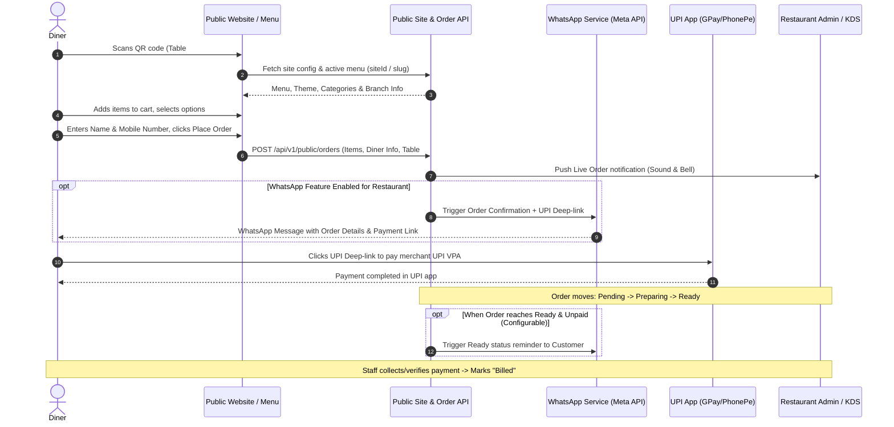
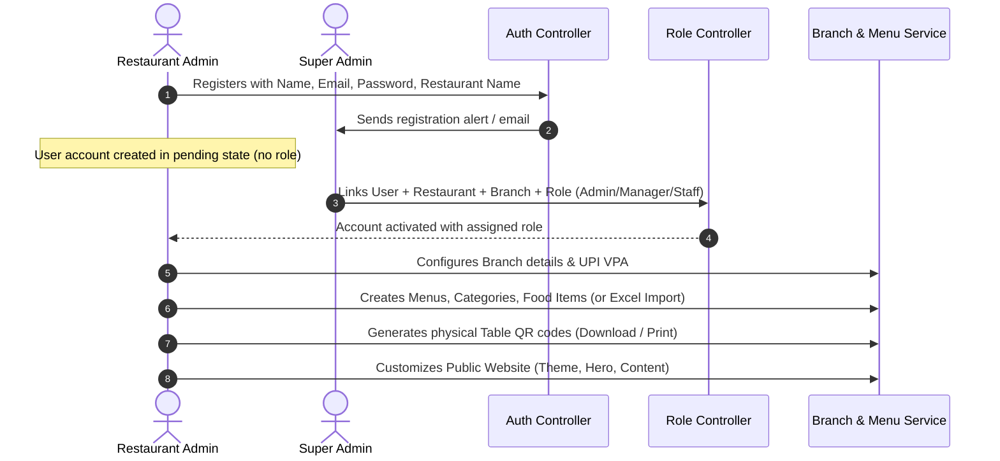

# Product Requirements Document (PRD)

## Restroly (RestroHub) — Digital Menu, Order & Multi-Tenant Restaurant Management Platform

| Field | Value |
|---|---|
| **Product** | Restroly (repo: [`rdodiya/RestroHub`]()) |
| **Owner / Lead** | Raj Dodiya (SuperAdmin of the platform) |
| **Status** | Active Development (GSSoC 2026, branch `gssoc_develop`) |
| **License** | MIT |
| **Primary Source** | Owner-authored `project-flow.txt` |
| **Secondary Source** | Codebase Analysis (`RestroHub` & `RestroHub-FrontEnd`), Architecture, and Repository `ReadMe.md` |
| **Doc Version** | 2.0 — Comprehensive Realignment with System Flow & Codebase |

> **Sourcing Note:** This document treats `project-flow.txt` as ground truth. Where the repository README was vague or contained outdated assumptions (e.g. payment reconciliation or customer accounts), this document follows `project-flow.txt`. Items marked **`@Todo`** are explicitly unbuilt per the owner. Items marked *(assumption)* are inferences requiring confirmation. Items marked *(open — owner flagged)* are questions raised directly by the project owner.

---

## 1. Overview & Vision

### 1.1 Product Summary
**Restroly** is a comprehensive, multi-tenant digital restaurant operating platform engineered specifically for Indian food establishments — ranging from street-side food stalls, food trucks, and local dhabas to QSRs, trendy cafes, and multi-location fine-dining chains.

Restroly eliminates high aggregator commissions (Zomato/Swiggy) and technical barriers by providing:
1. **Dynamic Branded Restaurant Websites & Digital Menus** with custom themes, localized sections, and per-restaurant subdomains (`<restaurantname>.restroly.in`).
2. **Contactless QR Ordering** supporting dual operational modes:
   - **Dine-In Table QR Codes**: Automatically assigns orders to a specific physical table and enables waiter service requests.
   - **Counter / Takeaway QR Codes**: Defaults `table_number = 0` for direct counter ordering, takeaway menus, and restaurant business cards.
3. **Commission-Free Direct UPI Payments**: Uses an automated deep-link builder targeting the restaurant owner's UPI VPA (GPay, PhonePe, Paytm, BHIM), bypassing intermediary payment gateway charges.
4. **Automated WhatsApp Notifications**: Dispatches instant WhatsApp order confirmations and UPI payment links via Meta Cloud API upon checkout and when orders transition to `Ready`.
5. **Kitchen Display System (KDS)**: Real-time order queue management for kitchen staff to streamline preparation and eliminate paper kitchen order tickets (KOT).
6. **Multi-Branch & Table Management**: Centralized management of multiple branches, tables, active menus, and staff permissions.
7. **Super Admin Platform Governance**: Multi-tenant RBAC, plan-based feature catalog, and restaurant subscription management.

**Tagline:** *Empowering Indian Restaurants to Go Digital — Simple, Fast & Powerful.*

### 1.2 Problem Statement & Solutions

| Pain Point | Restroly's Solution |
|---|---|
| **No digital presence** | Branded subdomain website (`restaurantname.restroly.in`) with live menu, editable theme, and dynamic content. |
| **Aggregator dependency & commissions** | Restaurant owns its digital presence, customer relationship, and direct orders without paying 20–30% commissions. |
| **Complex payment gateway setup** | Direct UPI deep links sent over WhatsApp to customer phones; zero gateway integration fees or verification overhead. |
| **No table-level ordering** | Scannable per-table QR codes automatically attach table number to live kitchen orders; counter QR defaults to `0`. |
| **Manual order relay to kitchen** | Kitchen Display System (KDS) shows real-time tickets to kitchen staff across `Pending`, `Preparing`, and `Ready`. |
| **Unstructured team permissions** | SuperAdmin-managed role bindings (Admin, Manager, Manager/User, Staff) scoped per restaurant tenant. |
| **Multi-outlet management friction** | Centralized multi-branch support with independent tables, QR codes, UPI IDs, and active menu mappings. |

---

## 2. Actors & Role-Based Access Control (RBAC)

Restroly enforces strict multi-tenant Role-Based Access Control across Diners, Restaurant Personnel, and Platform Administrators.

```
                    ┌─────────────────────────┐
                    │       Super Admin       │
                    │  (Platform Management)  │
                    └────────────┬────────────┘
                                 │ Links User + Restaurant + Branch + Role
         ┌───────────────────────┼───────────────────────┐
         │                       │                       │
         ▼                       ▼                       ▼
  ┌──────────────┐        ┌──────────────┐        ┌──────────────┐
  │ Restaurant   │        │   Manager    │        │    Staff     │
  │    Admin     │        │              │        │              │
  └──────┬───────┘        └──────┬───────┘        └──────┬───────┘
         │ Full Store Ctrl       │ Ops & Menus           │ Orders & KDS
         └───────────────────────┼───────────────────────┘
                                 │
                                 ▼
                    ┌─────────────────────────┐
                    │    Customer / Diner     │
                    │ (Guest Table / Counter) │
                    └─────────────────────────┘
```

### 2.1 Actor Definitions

| Actor | Access Level | Description & Core Responsibilities |
|---|---|---|
| **Customer / Diner** | Public / Unauthenticated | Scans a physical table or counter QR code, or visits `<restaurantname>.restroly.in`. Browses dynamic menu, places orders as guest (Name + Mobile Number), receives WhatsApp order updates & UPI payment links, and calls waiters via service requests. |
| **Admin (Restaurant Owner)** | Branch / Tenant Admin | Registers restaurant; upon approval by Super Admin, gains full administrative control over restaurant profile, multi-branch configurations, table QR generation, menu CRUD, Excel imports/exports, UPI VPA setup, website customization, KDS, order management, and analytics. |
| **Manager** | Operational Manager | Operational control assigned to one or more branches. Manages branch operations, daily live orders, table status, and active menu mappings. *(Scope provisional — see §2.2 & §8)* |
| **Manager/User** | Operational Read-Only | Read-only operational oversight of menus, tables, and live orders. **Strictly restricted from viewing financial figures, revenue reports, or UPI payment configurations.** |
| **Staff (Kitchen / Waiter)** | Operational Execution | Dedicated to live order fulfillment. Can update order statuses (`Pending` $\rightarrow$ `Preparing` $\rightarrow$ `Ready` $\rightarrow$ `Billed`), view the Kitchen Display System (KDS), and acknowledge table service alerts. Cannot edit menus, store settings, or pricing. |
| **Super Admin** | Global Platform Admin | Platform owner (Raj Dodiya). Reviews user registrations, links users to restaurants and branches with assigned roles, creates subscription plans, curates feature catalogs (WhatsApp, KDS, Templates, Excel, Multi-branch), and manages tenant subscriptions. |

### 2.2 Permissions Matrix

| Module / Screen | Super Admin | Restaurant Admin | Manager *(provisional)* | Manager/User | Staff |
|---|---|---|---|---|---|
| **Restaurant / Menus / Foods / Categories** | Read / Global | Full CRUD | Full / Edit *(provisional)* | Read-Only | Read-Only |
| **Branches & Tables** | Read / Global | Full CRUD | Manage assigned branches | Read-Only *(provisional)* | Read-Only *(provisional)* |
| **Payments & UPI Configuration** | No / Platform only | Full Control | Excluded *(provisional)* | **EXCLUDED** | **EXCLUDED** |
| **Orders (Live)** | No access | Full (Status + Cancel) | Full (Status + Cancel) | Read-Only *(provisional)* | **Update Status** (`Pending` $\rightarrow$ `Ready`) |
| **Order History & Reports** | No access | Full Filter/View | View assigned branch | Read-Only (no revenue) | No access *(provisional)* |
| **Kitchen Display System (KDS)** | Feature Gate Toggle | Access / Configure | Access | Access *(read)* | **Primary Operator** |
| **Website / Marketing Customizer** | Feature Gate Toggle | Full Editor | Undecided | Read-Only | No access |
| **Dashboard Analytics & Revenue** | Global stats | Full View | View ops metrics | **EXCLUDED (No Revenue)** | No access |
| **Subscriptions & Plans (Sidebar)** | **Full CRUD & Assign** | **No access** | **No access** | **No access** | **No access** |
| **User Role Linking (`/roles`)** | **Full Control** | **No access** | **No access** | **No access** | **No access** |

> [!IMPORTANT]
> **Owner's Explicit Directive:** The exact division between **Manager**, **Manager/User**, and **Staff** is under active discussion ("we need to think on staff and Manager/User roles for once"). In the backend, role checks must be enforced via Spring Security `@PreAuthorize` annotations on every endpoint, not just hidden in the frontend sidebar (`AdminRoute`).

### 2.3 Implemented Backend Permission Model (Phase 1 default — pending owner sign-off)

Phase 1 (§6.1) implements the matrix above as a **default** model on the backend. All role → permission rules live in one place, `security/Permission.java`, so the owner's final decision is a one-file change. Every secured endpoint checks a permission **and** tenant ownership via `@PreAuthorize("@access.can('…') and @access.branch(#branchId)")` (`security/AccessGuard.java`).

| Permission | Super Admin | Restaurant Admin / Owner | Manager | Manager/User | Staff |
|---|---|---|---|---|---|
| `PLATFORM_ADMIN` — plans, features, users, role linking, roles CRUD, restaurant delete, all-tenant stats | ✅ | — | — | — | — |
| `RESTAURANT_SETTINGS` — restaurant profile, branches, UPI VPA, subscription view, website config | ✅ | ✅ | — | — | — |
| `MENU_WRITE` — menus, categories, foods, tables, Excel import | ✅ | ✅ | ✅ | — | — |
| `OPERATIONS_READ` — menus, tables, orders, KDS, service requests | ✅ | ✅ | ✅ | ✅ | ✅ |
| `ORDER_STATUS_UPDATE` — status changes, cancel, mark-all-ready, staff-created orders, service-request ack | ✅ | ✅ | ✅ | — | ✅ |
| `VIEW_FINANCIALS` — order amounts, payment links, dashboard revenue, UPI links, Excel export | ✅ | ✅ | ✅ | — | — |

- **Tenant isolation:** a user can only reach restaurants they are linked to through `UserRoleRestaurant`, and the branches, menus, tables, orders, UPI links and service requests of those restaurants. Cross-tenant requests return `403`. Super Admin reaches every tenant.
- **Financial fields are removed server-side:** for roles without `VIEW_FINANCIALS`, order responses omit `totalAmount`, `paymentLink`, `unitPrice` and `subtotal`. Hiding them in the UI alone is not enough.
- **Branch access** is currently derived from restaurant membership: a Manager linked to a restaurant can reach all of its branches. Per-branch assignment is an open question (§8).
- **Role names** may be stored as `ROLE_ADMIN` or `ADMIN`; both map to the same authority. `MANAGER_USER` is the expected name for the Manager/User role.

---

## 3. End-to-End System & User Flows

### 3.1 Customer (Diner) Flow


1. **Entry & Dynamic Branding**:
   - Customer scans QR code either **at a table** (tagged with table number) or **at the counter** (defaults to table `0`; counter QR can also be printed on business cards/flyers).
   - Opens the restaurant site at `restaurantname.restroly.in` (*@Todo: Subdomain routing*).
   - Site renders dynamically from backend-supplied config: **Hero, Description / Story, Contact Details, Menu, Add-to-Cart drawer, and Language dropdown.**
2. **Ordering & Guest Checkout**:
   - Customer adds items to the cart from the dynamic menu.
   - At checkout, provides **Customer Name and Mobile Number only** — zero customer account creation, passwords, or app downloads.
3. **Automated WhatsApp Notification & UPI Link**:
   - On order placement, the admin panel receives an instant audio/visual notification.
   - If WhatsApp is enabled for that restaurant, the customer receives an automated WhatsApp message containing order details and a direct **UPI payment deep link**, generated via [`upi-deeplink-builder`](https://github.com/vivekkushwaha66/upi-deeplink-builder), targeting the branch's configured UPI VPA.
4. **Order Status Progression**:
   - Order moves through: `Pending` $\rightarrow$ `Preparing` $\rightarrow$ `Ready` $\rightarrow$ `Billed` (or `Cancelled`).
   - Customer receives status updates. If order reaches `Ready` and payment is still marked unpaid, a reminder payment message can be dispatched.
5. **Direct Commission-Free UPI**:
   - Restroly does **not** track or verify UPI payments directly (deliberate design choice). The deep link opens the customer's UPI app (GPay, PhonePe, Paytm, BHIM) and pays the owner directly. Staff verifies payment at the counter/table and updates order to `Billed`.
6. **Table Assistance**:
   - Diners seated at physical tables can tap a floating action button (Service FAB) to call a waiter. An instant alert is dispatched to the admin dashboard notification bell.

---

### 3.2 Restaurant Admin & Staff Management Flow


1. **Registration & Onboarding**:
   - Admin registers with user details and restaurant name. **No role selection during signup.**
   - SuperAdmin receives an email/notification alert and performs the linking step: **User $\leftrightarrow$ Restaurant $\leftrightarrow$ Branch $\leftrightarrow$ Role.** Unlinked users cannot access restaurant operational tools.
2. **Menu Management**:
   - **Menu:** CRUD operations; supports bulk import and export via Excel (`.xlsx`).
   - **Categories:** Organize food items logically.
   - **Food Items:** CRUD operations; live **availability toggle** to mark items out of stock instantly without deleting them.
3. **Multi-Branch Operations**:
   - Manage branches granted access to by SuperAdmin.
   - Each branch selects its own **active menu**.
   - Admin panel displays one branch's context at a time; a persistent **branch-switcher dropdown in the admin header is planned (`@Todo`)**.
4. **Tables & QR Generation**:
   - CRUD on tables per branch.
   - System generates downloadable, printable QR codes per table and master Counter QR (`0`).
5. **Order Management & History**:
   - Live orders for today displayed in real time across `Pending`, `Preparing`, `Ready`, `Billed`, and `Cancelled`.
   - **Order History (`@Todo`)**: Dedicated history view with backend API supporting date range filtering, status sorting, diner phone search, and pagination.
6. **Kitchen Display System (KDS)**:
   - Dedicated full-screen kitchen interface displaying active cooking tickets (`Pending`, `Preparing`, `Ready`).
   - Gated by a per-restaurant **KDS feature flag**, moving to SuperAdmin subscription control.
7. **Marketing Website Customizer**:
   - **Theme Editor** *(done)*: Primary colors, fonts, visual styling.
   - **Section & Content Editor** *(done)*: Brand identity, hero banner, about story, contact info.
   - **Live Preview** *(done)*: Real-time rendering preview.
   - **Template Selection**: Free subscription tier provides **2 default templates**. Extended marketplace is **`@Todo`**.
8. **Payments Setup**:
   - Admin configures branch UPI ID (VPA) and Payee Name for deep link generation. Zero intermediary transaction charges.
9. **Dashboard & Analytics**:
   - Visual KPI cards and trend charts. UI exists, but backend API wiring is actively **`@Todo`**.
10. **Notifications & Theme**:
    - Header notification bell with badge counter for new orders and table service requests.
    - Dark / Light mode toggle in admin header.

---

### 3.3 Super Admin Governance Flow
1. **User Role Management** (`/admin/role-management`):
   - Users self-register without roles.
   - SuperAdmin selects: **User $\rightarrow$ Restaurant $\rightarrow$ Branch $\rightarrow$ Role (`Admin`, `Manager`, `Manager/User`, `Staff`).**
   - SuperAdmin can update or revoke roles at any time.
2. **Subscription & Feature Management** (`/admin/subscriptions`):
   - SuperAdmin-only module; hidden from all other roles.
   - Full CRUD and search on **Subscription Plans** (Free, Starter, Pro, Enterprise).
   - Full CRUD and search on **Subscription Features** (`WHATSAPP_NOTIFICATIONS`, `KDS_ACCESS`, `MULTI_BRANCH`, `EXCEL_IMPORT_EXPORT`, `CUSTOM_WEBSITE_TEMPLATES`, `ADVANCED_ANALYTICS`).
   - Assign features to plans; assign plans to restaurants.
   - Current subscription status lookup per restaurant.

---

## 4. Key Design Decisions (Confirmed Architectures)

The following architectural choices are deliberate decisions confirmed by the project owner, not gaps or defects:

| Decision | Rationale & Architectural Implication |
|---|---|
| **No Payment Gateway / No Reconciliation** | Direct UPI deep-links keep the platform 100% free of transaction fees and eliminate expensive PSP integrations. Payment status is self-reported by staff/admin (marked `Billed`), never verified via banking webhooks. Any future feature (like auto-invoicing) must honor this self-reported workflow. |
| **No Customer Accounts (Guest Checkout)** | Requiring only Name and Mobile Number eliminates friction for diners at tables. There is no customer login, password reset, or saved profile. |
| **No Customer Activity Tracking** | User behavioral activity on the public site (e.g. bounce rates, funnel drop-offs, heatmaps) is intentionally not tracked. System focuses strictly on menu display and order capture. |
| **Subdomain Tenant Resolution** | Each restaurant operates under `<restaurantname>.restroly.in`. The platform resolves the tenant context from the incoming `Host` header via a shared multi-tenant backend architecture. |

---

## 5. Detailed Functional Requirements

### 5.1 Public Site & Ordering (`FR-CUST`)
- **FR-CUST-1 (Dynamic Subdomain Routing - @Todo)**: Public site is served per-restaurant at `<restaurantname>.restroly.in`. Backend extracts tenant slug from `Host` header.
- **FR-CUST-2 (Dual QR Handling)**:
  - Table QR: URL encodes `?tableNumber=X`. Persists table ID in session and displays sticky table banner.
  - Counter QR: Encodes `table_number = 0`. Disables waiter calls and marks order as takeaway/counter.
- **FR-CUST-3 (Dynamic Section Rendering)**: Public site dynamically renders Hero, Description, Contact, Menu, Add-to-cart, and Language dropdown.
- **FR-CUST-4 (Guest Ordering)**: Diners add food items to cart and check out with **Customer Name** and **Customer Mobile Number** only.
- **FR-CUST-5 (Table Waiter Assistance)**: Diners at tables can trigger a "Call Waiter" request, creating a service alert in the admin notification bell.
- **FR-CUST-6 (Multi-Language Menu)**: Frontend language dropdown allows switching menu language.

### 5.2 Direct UPI Payment & WhatsApp (`FR-PAY` & `FR-NOTIF`)
- **FR-PAY-1 (Direct Deep-Link Generation)**: Generates standard UPI payment URIs (`upi://pay?pa={vpa}&pn={name}&am={amount}&tn=Order_{id}&cu=INR`) via `upi-deeplink-builder`.
- **FR-PAY-2 (Zero Gateway Fees)**: Direct peer-to-merchant UPI transfer; zero transaction fees, zero third-party gateway dependencies.
- **FR-PAY-3 (Branch UPI Configuration)**: Admin configures UPI VPA and payee name per branch.
- **FR-NOTIF-1 (WhatsApp Order Confirmation)**: On order creation, dispatches WhatsApp message with order details and UPI deep link (gated by restaurant WhatsApp feature flag).
- **FR-NOTIF-2 (WhatsApp Ready Status Reminder)**: Dispatches follow-up WhatsApp notification when order transitions to `Ready` if payment is unpaid. *(Exact resend trigger rule configurable — see §8)*.
- **FR-NOTIF-3 (In-App Notification Bell)**: Real-time visual badge and audio chime alerting staff of incoming orders and table waiter calls.

### 5.3 Menu Management (`FR-MENU`)
- **FR-MENU-1 (Catalog CRUD)**: CRUD operations on Menus, Categories, and Food Items.
- **FR-MENU-2 (Availability Toggle)**: Immediate toggle to mark items available or out of stock without deletion.
- **FR-MENU-3 (Excel Bulk Import/Export)**: Bulk upload/download of menu catalogs using `.xlsx` spreadsheets via [`ExcelFeatureController.java`](/RestroHub/src/main/java/com/restroly/qrmenu/excel/controller/ExcelFeatureController.java).
- **FR-MENU-4 (Branch Menu Binding)**: Each branch selects one active menu from the restaurant's catalog.

### 5.4 Branch & Table Management (`FR-STORE`)
- **FR-STORE-1 (Branch Administration)**: CRUD on branches assigned to admin by SuperAdmin.
- **FR-STORE-2 (Admin Header Branch Switcher - @Todo)**: Persistent dropdown in admin header to switch active branch context across all admin pages.
- **FR-STORE-3 (Table CRUD & QR Download)**: Manage tables per branch with downloadable, printable QR codes.
- **FR-STORE-4 (Counter QR Generation)**: Dedicated action to generate master Counter QR code (`table_number = 0`).

### 5.5 Order Fulfillment & KDS (`FR-ORD` & `FR-KDS`)
- **FR-ORD-1 (Live Daily Orders)**: Real-time board displaying today's orders across `Pending`, `Preparing`, `Ready`, `Billed`, and `Cancelled`.
- **FR-ORD-2 (Status Transitions)**: Authorized staff can advance orders or cancel with notes.
- **FR-ORD-3 (Order History & Filters - @Todo)**: Historical order view with backend API supporting date range filters, status sorting, diner phone search, and pagination.
- **FR-KDS-1 (Kitchen Display System)**: Dedicated kitchen screen displaying active cooking tickets (`Pending`, `Preparing`, `Ready`).
- **FR-KDS-2 (KDS Feature Flag)**: Gated via per-restaurant KDS flag, controlled by SuperAdmin via subscription feature flags.

### 5.6 Marketing Website Customizer (`FR-MKT`)
- **FR-MKT-1 (Theme Editor)**: Colors, typography, and visual styling (Done).
- **FR-MKT-2 (Content & Section Editor)**: Brand identity, hero banner, story, gallery, contact info (Done).
- **FR-MKT-3 (Live Preview)**: Split-screen preview of mobile and desktop layouts (Done).
- **FR-MKT-4 (Free Tier Template Limiting - @Todo)**: Restaurants on Free subscription tier restricted to 2 default templates.

### 5.7 Analytics & Dashboard (`FR-DASH`)
- **FR-DASH-1 (Dashboard KPIs - @Todo)**: Wire backend API to display Total Revenue, Total Orders, Average Order Value (AOV), and Active Tables.
- **FR-DASH-2 (Trend Graphs - @Todo)**: Sales distribution, daily revenue charts, and top-selling food items connected to [`DashboardController.java`](/RestroHub/src/main/java/com/restroly/qrmenu/admin/dashboard/controller/DashboardController.java).

### 5.8 Super Admin Governance & Subscriptions (`FR-SUB` & `FR-ROLE`)
- **FR-ROLE-1 (User Role Management)**: Users self-register with no role; SuperAdmin links User $\leftrightarrow$ Restaurant $\leftrightarrow$ Branch $\leftrightarrow$ Role.
- **FR-ROLE-2 (Role Revocation)**: SuperAdmin can update or remove role assignments.
- **FR-ROLE-3 (Granular Role Guards - @Todo)**: Server-side `@PreAuthorize` enforcement ensuring `Manager/User` cannot view payments/financials, and `Staff` can only update order statuses.
- **FR-SUB-1 (Subscription Plan CRUD)**: SuperAdmin CRUD and search on plans, pricing, and limits.
- **FR-SUB-2 (Feature Catalog CRUD)**: SuperAdmin definition of platform feature flags.
- **FR-SUB-3 (Plan & Restaurant Assignment)**: Assign features to plans; assign plans to restaurants.
- **FR-SUB-4 (SuperAdmin Sidebar Isolation)**: Subscription and Role management screens are visible only to SuperAdmin in the frontend and secured strictly on the backend.

---

## 6. Architectural & API Surface Mapping

Base backend path: `http://localhost:8181/restroly` (Swagger UI at `/restroly/swagger-ui.html`).

| Controller Class | Base Endpoint | Primary Responsibilities |
|---|---|---|
| [`PublicSiteController.java`](/RestroHub/src/main/java/com/restroly/qrmenu/template/controller/PublicSiteController.java) | `/public/api/v1/sites` | Public site configuration, dynamic template rendering, active menu lookup |
| [`PublicOrderController.java`](/RestroHub/src/main/java/com/restroly/qrmenu/order/controller/PublicOrderController.java) | `/api/v1/public/orders` | Diner guest order placement, order status polling |
| [`OrderController.java`](/RestroHub/src/main/java/com/restroly/qrmenu/order/controller/OrderController.java) | `/api/v1/orders` | Admin live order management, status updates, order history & filtering |
| [`ServiceRequestController.java`](/RestroHub/src/main/java/com/restroly/qrmenu/notification/controller/ServiceRequestController.java) | `/api/v1/service-requests` | Diner waiter calls, table assistance logging and resolution |
| [`DashboardNotificationController.java`](/RestroHub/src/main/java/com/restroly/qrmenu/notifications/controller/DashboardNotificationController.java) | `/api/v1/notifications` | Admin notification feed, unread alerts, live bell counter |
| [`DashboardController.java`](/RestroHub/src/main/java/com/restroly/qrmenu/admin/dashboard/controller/DashboardController.java) | `/api/v1/admin/dashboard` | Analytical KPIs, revenue stats, sales trends, top dishes |
| [`BranchController.java`](/RestroHub/src/main/java/com/restroly/qrmenu/branch/controller/BranchController.java) | `/api/v1/branches` | Multi-branch CRUD, active menu binding |
| [`TableController.java`](/RestroHub/src/main/java/com/restroly/qrmenu/table/controller/TableController.java) | `/api/v1/tables` | Table management, QR code payload generation |
| [`MenuController.java`](/RestroHub/src/main/java/com/restroly/qrmenu/menu/controller/MenuController.java) | `/secure/api/v1/menus` | Menu management and branch assignment |
| [`CategoryController.java`](/RestroHub/src/main/java/com/restroly/qrmenu/category/controller/CategoryController.java) | `/api/v1/categories` | Food category taxonomy |
| [`FoodController.java`](/RestroHub/src/main/java/com/restroly/qrmenu/food/controller/FoodController.java) | `/api/v1/foods` | Food item CRUD, availability toggle |
| [`ExcelFeatureController.java`](/RestroHub/src/main/java/com/restroly/qrmenu/excel/controller/ExcelFeatureController.java) | `/api/v1/excel` | Bulk menu import and export via `.xlsx` |
| [`UpiLinkController.java`](/RestroHub/src/main/java/com/restroly/qrmenu/payment/controller/UpiLinkController.java) | `/api/v1/upi` | Branch UPI VPA setup, test URI generation |
| [`RoleController.java`](/RestroHub/src/main/java/com/restroly/qrmenu/user/controller/RoleController.java) | `/api/v1/roles` | Role assignment and tenant linking by Super Admin |
| [`SuperAdminSubscriptionController.java`](/RestroHub/src/main/java/com/restroly/qrmenu/subscription/controller/SuperAdminSubscriptionController.java) | `/api/v1/super-admin/subscriptions` | Subscription plans, feature catalog, restaurant plan assignment |
| [`RestaurantSubscriptionController.java`](/RestroHub/src/main/java/com/restroly/qrmenu/subscription/controller/RestaurantSubscriptionController.java) | `/api/v1/restaurant/subscriptions` | Current plan lookup, active feature verification |

---

## 7. Outstanding Tasks & Implementation Backlog (@Todo)

The following 6 concrete items represent the active technical backlog from `project-flow.txt`:

1. **`@Todo-1` Subdomain Dynamic Routing**: Enable wildcard DNS / reverse-proxy resolution for `<restaurantname>.restroly.in` to load the restaurant website dynamically without requiring path parameters (`/Restrohub/:restaurantName/:branchId`). Reference code exists in [`PublicSiteController.java`](/RestroHub/src/main/java/com/restroly/qrmenu/template/controller/PublicSiteController.java).
2. **`@Todo-2` Admin Header Branch Selector**: Implement a persistent branch dropdown in the top second header of the Admin panel (`AdminLayout.jsx`) to switch the active branch context across Tables, Orders, KDS, and Menus.
3. **`@Todo-3` Order History Integration**: Implement the backend query and frontend view for Order History with date range filtering, status sorting, diner phone search, and pagination.
4. **`@Todo-4` Dashboard Analytics Backend Integration**: Connect [`DashboardController.java`](/RestroHub/src/main/java/com/restroly/qrmenu/admin/dashboard/controller/DashboardController.java) endpoints to the React [`Dashboard.jsx`](/RestroHub-FrontEnd/src/components/admin/dashboard/Dashboard.jsx) charts and metric cards.
5. **`@Todo-5` Free Tier Template Restriction**: Enforce a limit of 2 default templates for restaurants on the Free subscription plan within [`WebsiteWrapper.jsx`](/RestroHub-FrontEnd/src/components/admin/marketing/website/WebsiteWrapper.jsx) and [`ThemeSelector.jsx`](/RestroHub-FrontEnd/src/components/admin/marketing/website/ThemeSelector.jsx).
6. **`@Todo-6` Granular Role Enforcement**: Fine-tune backend `@PreAuthorize` annotations and frontend navigation guards for `Manager/User` (hide payment/revenue views) and `Staff` (order status updates only).

---

## 8. Open Questions & Inferences Requiring Confirmation

The following questions were flagged directly by the project owner or surfaced during codebase analysis:

1. **Permission Scope for `Manager` vs. `Manager/User` *(owner flagged)* — Resolved (default model implemented, pending final owner sign-off):**
   - Which sections beyond "excludes payments" are read-only vs. editable for `Manager` and `Manager/User`? Does `Manager/User` ever have write access, or is it strictly read-only?
   - *Phase 1 default (§2.3):* Manager runs operations and edits menus/tables and sees financials, but has no restaurant settings, UPI VPA, billing or plan access. Manager/User is strictly read-only with no financial fields. Staff reads operations and moves order statuses only. Change `security/Permission.java` to adjust.
2. **WhatsApp Payment Link Resend Rules:**
   - What is the exact trigger for resending the WhatsApp payment link — on order success only, on transition to `Ready` if unpaid, or on demand via an admin button?
3. **Subdomain Architecture:**
   - Is subdomain resolution implemented via wildcard DNS with a single app instance parsing the `Host` header, or via edge reverse proxy (Nginx / Cloudflare)?
4. **KDS Feature Flag Migration:**
   - The KDS toggle currently lives on the admin side; what is the exact migration schedule to move full control to SuperAdmin plan-based feature flags?
5. **Free vs. Paid Plan Limits:**
   - Beyond limiting to 2 templates, what specific limits apply to Free vs. Paid tiers (e.g. maximum branches, tables, monthly orders, WhatsApp notifications)?
6. **Order History Filter Minimum Spec:**
   - Are date range, status, customer phone, and table number sufficient, or are payment status and order value filters required?
7. **Category & Food ownership *(surfaced in Phase 1 §6.1 audit — blocks full tenant isolation)*:**
   - `Category` and `Food` have no restaurant or branch owner; they are linked to restaurants only through the many-to-many Menu ↔ Category table, so one category can be shared across tenants. Category/Food endpoints are role-checked only, not tenant-scoped. **Proposal:** add a `restaurant_id` column to both, with a migration that backfills it from the existing menu links and flags categories shared across restaurants for manual review. Needs owner confirmation that categories are per-restaurant, not a shared global catalogue.
8. **Per-branch Manager assignment *(Phase 1 §6.1)*:**
   - Today a Manager linked to a restaurant can reach every branch of it. Should Managers, Manager/Users and Staff be restricted to specific branches? That would need a user ↔ branch assignment table.
9. **Restaurant-level user management *(Phase 1 §6.1)*:**
   - `/secure/api/v1/users/**` admin endpoints listed every user on the platform; they are now Super Admin only. Should Restaurant Admins manage their own staff accounts? That needs restaurant-scoped user endpoints.
10. **"All branches" dashboard view *(Phase 1 §6.1)*:**
    - The admin UI previously sent hardcoded branch `1` for "All branches", which showed another restaurant's data. It now uses the user's first branch until a restaurant-wide aggregate endpoint exists (planned with §6.4 dashboard work).

---

## 9. Non-Functional Requirements

| Dimension | Specification |
|---|---|
| **Multi-Tenancy & Data Isolation** | Strict tenant scoping enforced across all database queries. A user linked to Restaurant A must never read, mutate, or query data for Restaurant B. |
| **Performance** | Public digital menu and dynamic website must load in $< 1.5$ seconds on standard Indian 4G mobile connections. API p95 response time for menu reads under 300 ms. |
| **Security** | Stateless JWT authentication, role guards on all secured endpoints, strict CORS whitelist, input sanitization, zero committed credentials. Server-side `@PreAuthorize` checks on all admin and subscription endpoints. |
| **Mobile-First Experience** | 100% of diner-facing interfaces and KDS must be touch-optimized, responsive, and render flawlessly across 320px to 4K resolutions. |
| **Zero Transaction Overhead** | Direct UPI deep-linking ensures zero payment gateway commission deductions and instant direct merchant settlement. |
| **Theme & Accessibility** | Full Dark Mode and Light Mode support across the entire Admin and KDS dashboards via Tailwind dark classes. |

---

## 10. Appendix & Maintainer Reference

- **Git Repository**: [`rdodiya/RestroHub`](https://github.com/rdodiya/RestroHub)
- **Active Development Branch**: `gssoc_develop`
- **Platform Owner**: Raj Dodiya (`rdodiya2601@gmail.com`)
- **Key Reference Backend Controller**: [`PublicSiteController.java`](/RestroHub/src/main/java/com/restroly/qrmenu/template/controller/PublicSiteController.java) — inspect before modifying public site or subdomain routing.
- **External Dependency**: [`upi-deeplink-builder`](https://github.com/vivekkushwaha66/upi-deeplink-builder) — generates UPI payment deep links.
- **Contribution Standards**: Conventional Commits, clean PR descriptions referencing open issues, and zero committed credentials.
